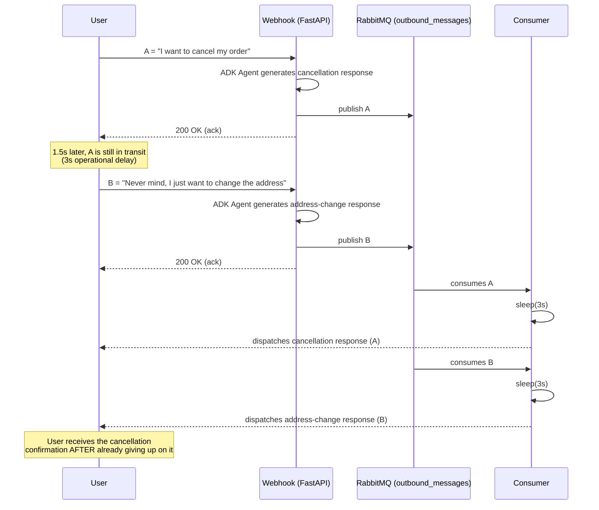
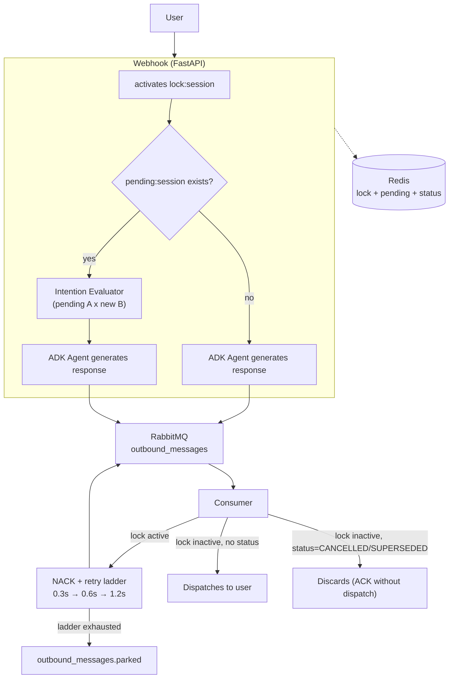
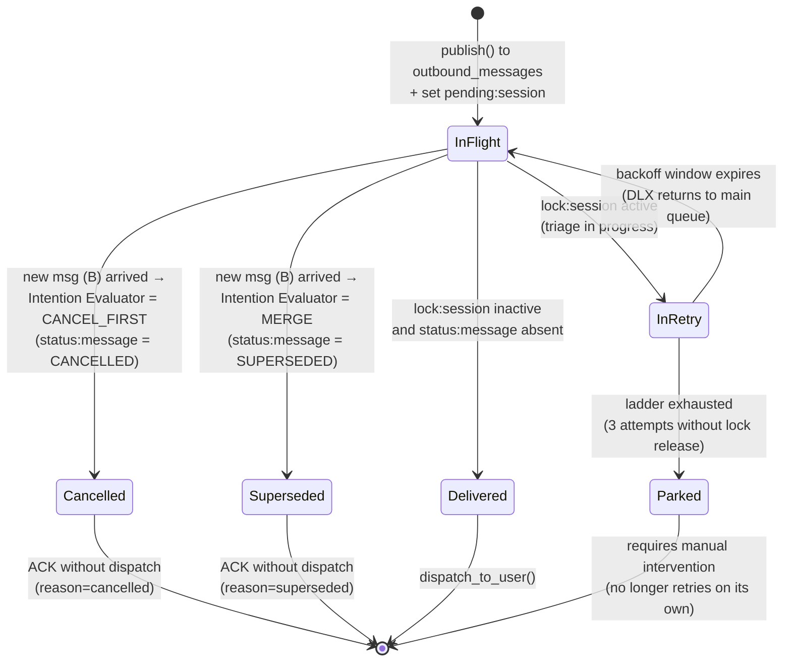
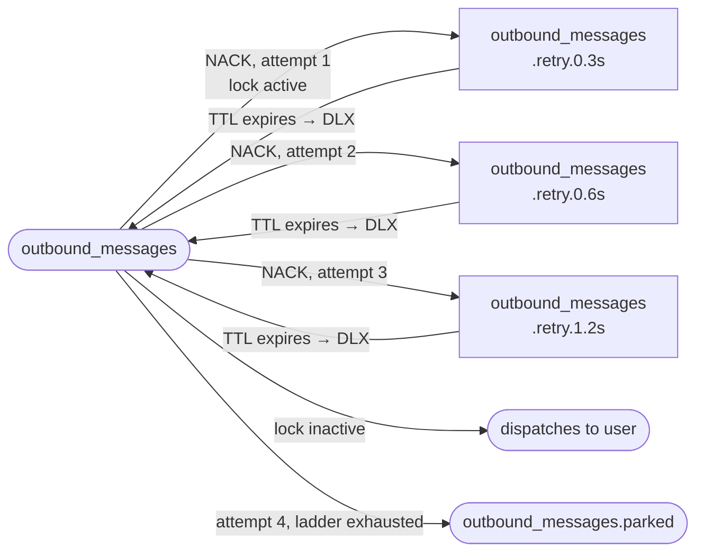

## Introduction

This article presents a complete case study on **concurrent state management in conversational AI Agents**.
In high-volume messaging applications (like WhatsApp, Telegram, or webchats), it's common for a user to send multiple messages in sequence (message A followed by message B within a short interval) before the first response is generated and delivered.
Without architectural concurrency control, the system suffers from duplicated token consumption in LLMs, context desynchronization, and delivery of contradictory or out-of-order responses.
- **Scope:** Concurrent State / Message Debouncing in AI Agents.
- **Languages and Stack:** Python, FastAPI, Google ADK, Redis, RabbitMQ.
- **Business Impact:** Eliminates the delivery of stale or contradictory responses, reduces wasted tokens on redundant LLM calls, and guarantees predictable delivery semantics under high traffic.

> **Source Code**
> Full repository on GitHub containing the evolutionary branches, simulation scripts, and Docker Compose instructions:
> 🔗 https://github.com/marcelo3macedo/gerenciamento-estado-concorrente-no-adk

---

## The Problem

In conversational systems based on Artificial Intelligence agents, users' actual behavior on messaging channels (like WhatsApp, Telegram, or Webchat) differs drastically from HTTP's traditional synchronous request-response model.
Users interact fluidly and frequently send messages in short, sequential bursts (_rapid-fire messaging_).
For example:
- a customer might send a first message A (_"I want to cancel order 10"_)
- and then, right after — before the response to message A is even delivered, or while it's still traveling through the network/dispatch queue —
- send a second message B (_"Never mind, actually I just want to change the address"_).

When the agent's architecture operates in a decoupled, asynchronous way — where a webhook receives each message in isolation, triggers LLM inference, and queues the response in a message broker with operational delay — a **race condition and state-management failure** emerges.




The problem manifests across three critical dimensions:

**Semantic Inconsistency and Contradictory Responses**
Since message A has already started its lifecycle in the agent, the system generates the cancellation confirmation and sends it to the outbound queue.
When message B arrives 1.5 seconds later, the agent generates the address-change response and queues it right after.
On the user's channel, however, the cancellation response for A is delivered _after_ the customer has already given up on the cancellation, creating noise and eroding trust.

**Computational and Financial Waste**
The agent consumes significant compute resources and input/output tokens on the model's (LLM) API to process and generate the response to message A, unaware that the dialogue context was completely invalidated seconds later by message B.

**Broken User Experience (UX)**
Out-of-order chat bubbles overlapping violates the conversational expectations of enterprise-grade virtual assistants.

---
## The Solution Architecture

To resolve the race condition, the architecture uses **Redis as a distributed lock manager** tied to the session identifier, and **RabbitMQ as an asynchronous dispatch queue**.
Whenever a new message enters the system while a previous response is still being processed or is waiting to be sent from the outbound queue, Redis signals an active lock.
This lock intercepts the RabbitMQ consumer, preventing the in-flight message from being dispatched to the user until an evaluator agent determines whether the previous response should be released, canceled, or merged with the new input.




Across three branches, `order-service` progressively gained the layers needed to treat this concurrency as a first-class problem, not a bug to hide:

| Branch                                                                                                                                                                                          | What was added                                                                                               |
| ----------------------------------------------------------------------------------------------------------------------------------------------------------------------------------------------- | ------------------------------------------------------------------------------------------------------------ |
| [`feature/01-naive-fastapi-rabbitmq-delay`](https://github.com/marcelo3macedo/gerenciamento-estado-concorrente-no-adk/tree/feature/01-naive-fastapi-rabbitmq-delay)                             | Baseline scenario: webhook + ADK agent + outbound queue with operational delay, no concurrency protection whatsoever |
| [`feature/02-redis-lock-rabbitmq-exponential-backoff`](https://github.com/marcelo3macedo/gerenciamento-estado-concorrente-no-adk/tree/feature/02-redis-lock-rabbitmq-exponential-backoff)       | Redis session lock + exponential-backoff retry ladder on the consumer via RabbitMQ DLX                 |
| [`feature/03-google-adk-intent-evaluator-triage`](https://github.com/marcelo3macedo/gerenciamento-estado-concorrente-no-adk/tree/feature/03-google-adk-intent-evaluator-triage)                 | **Intention Evaluator** decides RELEASE_FIRST / CANCEL_FIRST / MERGE                                                |
| [`feature/04-e2e-simulative-tests-pytest-testcontainers`](https://github.com/marcelo3macedo/gerenciamento-estado-concorrente-no-adk/tree/feature/04-e2e-simulative-tests-pytest-testcontainers) | E2E test suite with testcontainers                                                                                       |

---
## Message state during processing

This is the core of the case: a message published to `outbound_messages` isn't just "delivered or not delivered" — it moves through a small set of states, tracked in two Redis structures and checked by the consumer on every dispatch attempt.



The lock and the per-message status answer different questions:
- the lock says *"wait, this session is under triage"*
- the status says *what to do* with the held message once triage finishes.

---
### The retry ladder
While the lock is active, the consumer doesn't poll or hold the message in memory — it `NACK`s and republishes it to a delay queue with a TTL that grows with each attempt:



The timeline below is real data, pulled straight from the logs of a suite run: a lock that never gets released causes the message to exhaust all 3 attempts and land in `outbound_messages.parked`, never reaching the user and never retrying forever:

```chart

{

"type": "line",

"title": "Real timeline: parked message (lock never released)",

"xKey": "evento",

"data": [

{ "evento": "t=0.00s\npublish + attempt #1", "elapsed": 0.00 },

{ "evento": "t=0.60s\noperational delay + rejection #1", "elapsed": 0.60 },

{ "evento": "t=0.90s\nrejection #2", "elapsed": 0.90 },

{ "evento": "t=1.51s\nrejection #3", "elapsed": 1.51 },

{ "evento": "t=2.71s\nparked (attempts=3)", "elapsed": 2.71 }

],

"series": [

{ "key": "elapsed", "label": "Elapsed time (s)", "color": "#EF4444" }

]

}

```

- **0.00s — Publish and 1st attempt**: The response is generated and posted to the RabbitMQ outbound queue.
- **0.60s — Operational Delay and Rejection #1**: The _consumer_ picks up the message after the transport time (0.60s) and checks Redis. Since the lock is still active, it applies a `NACK` (rejection) and places the message on a retry (_backoff_) queue with a 0.3s delay.
- **0.90s — Rejection #2**: After the 0.3s delay elapses (0.60s + 0.30s = 0.90s), the _consumer_ tries to deliver the message again. The Redis lock is still held. It rejects again and applies the next step of the ladder, now 0.6s.
- **1.51s — Rejection #3**: After the 0.6s delay elapses (0.90s + 0.60s = 1.50s/1.51s), a third attempt occurs. Since the lock is still active, the system applies the ladder's final delay tier, 1.2s.
- **2.71s — Parking**: After the 1.2s of the last delay elapses (1.51s + 1.20s = 2.71s), the system determines it has exhausted the 3-retry limit without the lock being released. The message is then moved to the `outbound_messages.parked` queue.

This prevents stuck messages from being reprocessed indefinitely, which would needlessly consume server CPU and memory.

---

## Decision Analysis

Detailed information on the main decisions in this case:

| **Decision**                                                                                                                     | **Alternative Considered**                                         | **Why It Was Chosen?**                                                                                                                                       | **Accepted Trade-off**                                                                                                                           |
| ------------------------------------------------------------------------------------------------------------------------------- | ------------------------------------------------------------------- | ---------------------------------------------------------------------------------------------------------------------------------------------------------------- | ---------------------------------------------------------------------------------------------------------------------------------------------- |
| **Explicit lock release** at the end of triage, TTL only as a safety net                                               | Rely solely on the lock's TTL (5s) to release the session               | Holding the lock until the TTL expires would make every in-flight message wait up to 5s even when triage finishes in milliseconds — unnecessary in most cases.  | If the webhook process dies between activating and releasing the lock, the message keeps retrying (backoff) until the lock expires via TTL             |
| **Decision matrix via a 2nd ADK agent** (`output_schema=IntentionDecision`, no tools, ephemeral session)                          | Deterministic heuristic (keywords, text similarity)   | Distinguishing "cancel" from "don't cancel, never mind" requires understanding the sentence's intent, not just the presence of keywords.                                                  | Every collision (B arriving while A is still in flight) adds an extra LLM call to B's latency, plus the cost of a second ADK session per evaluation. |
| **Retry with backoff capped at 3 attempts + parking queue**                                                                 | Infinite retry until the lock releases                                  | A lock that never releases (webhook crash) can't turn into a message retrying forever and consuming the consumer.                                                        | Parked messages aren't automatically redelivered; they require manual intervention or a separate reprocessing job.                |
| **Asynchronous delivery via RabbitMQ** (webhook publishes, consumer dispatches) instead of a synchronous response in `POST /webhook/message` | Return the agent's response directly in the HTTP response body | Necessary to simulate and test a real channel's operational delay, and for the lock to make sense — without a queue, there's no "in-flight message" to re-evaluate. | Additional latency (the operational delay) between generating the response and delivering it, even on the happy path with no collision at all.                  |


---

## Example Cases

`scripts/simulate_intention_triage.py` reproduces the 3 decision paths via HTTP, each in its own session. The times below are real, pulled from the E2E suite logs, with A and B separated by ~0.3s, within the 0.6s operational-delay window configured for the tests:

**Decision 1 — RELEASE_FIRST** (B doesn't conflict with A)
A = *"What are your business hours?"*, B = *"And do you accept PIX?"*. Nothing is flagged in Redis; both responses reach the user, A first (606ms), B shortly after (891ms).

**Decision 2 — CANCEL_FIRST** (B nullifies A)
A = *"I want to cancel my order"*, B = *"Actually don't cancel it, I just received it"*. A is flagged `CANCELLED`; the consumer discards A (`reason=cancelled`, 607ms after the webhook) without dispatching it to the user. Only B's response arrives (892ms).

**Decision 3 — MERGE** (B complements A)
A = *"Add a pepperoni pizza"*, B = *"And a 2L Coke too"*. A is flagged `SUPERSEDED`; the consumer discards A (`reason=superseded`, 608ms). Since the agent's session already has A in memory, the second turn produces a single response covering both items — the user receives one combined reply (893ms), never two.

**Extra case — Parking**
Message published, lock activated and **never** released. The retry ladder exhausts all 3 attempts (0.6s + 0.3s + 0.6s + 1.2s) and the message is moved to `outbound_messages.parked` at 2.71s, never reaching the user and never retrying forever.

```chart

{

"type": "bar",

"title": "Latency to outcome, per message (ms) — real E2E suite data",

"xKey": "mensagem",

"data": [

{ "mensagem": "RELEASE_FIRST — A (delivered)", "ms": 606 },

{ "mensagem": "RELEASE_FIRST — B (delivered)", "ms": 891 },

{ "mensagem": "CANCEL_FIRST — A (discarded)", "ms": 607 },

{ "mensagem": "CANCEL_FIRST — B (delivered)", "ms": 892 },

{ "mensagem": "MERGE — A (discarded)", "ms": 608 },

{ "mensagem": "MERGE — B (delivered)", "ms": 893 },

{ "mensagem": "Parking — never delivered", "ms": 2711 }

],

"series": [

{ "key": "ms", "label": "Latency to outcome (ms)", "color": "#3B82F6" }

]

}

```
---

## Observed Takeaways
- **The lock is just the signal; the intelligence lives in the three triage decisions**: The Redis lock and the RabbitMQ _backoff_ contain the immediate symptom of concurrency (preventing responses from trampling each other), but what actually resolves the user experience is the intention matrix:
    - **`RELEASE_FIRST` (Release)**: When the new message doesn't conflict with the previous one (e.g., a question about business hours followed by a question about payment methods), the system releases the held response and processes the next one in the queue, ensuring order and fluidity.
    - **`CANCEL_FIRST` (Cancellation)**: When the second message nullifies the first (e.g., "I want to cancel the order" followed by "never mind, don't cancel"), sending the first response is aborted. This generates **direct token savings** (FinOps) by avoiding redundant LLM interactions and generations, and it also prevents a stale cancellation confirmation from reaching the user.
    - **`SUPERSEDED` (Unification / Merge)**: When the new message complements the previous one (e.g., "add a pizza" followed by "and a 2L soda"), the first message is flagged as superseded. The agent generates **a single consolidated response** with both items, eliminating the visual clutter of multiple chat bubbles.
- **Humanized behavior and user experience (UX)**: The architecture precisely mimics the dynamics of a **real human agent**. If a human operator is typing a reply to a customer and notices a new message has just arrived on screen, they stop typing, re-evaluate the context, and respond to everything in a unified way. Bringing this mechanic to the AI agent dramatically raises the perceived quality of support, avoiding robotic interactions.
- **TTL and parking queue against infinite loops**: The combination of an exponential _backoff_ ladder with a retry ceiling ensures the system tolerates severe infrastructure failures (like the webhook process unexpectedly dying during triage). Instead of entering an **infinite processing loop** consuming CPU and memory, the message hits the limit and is safely moved to the `outbound_messages.parked` queue. This preserves the ecosystem, isolates the problem, and keeps the consumer free to serve other users.

The complete code, with all four branches and the test suite, is at:
- [github.com/marcelo3macedo/gerenciamento-estado-concorrente-no-adk](https://github.com/marcelo3macedo/gerenciamento-estado-concorrente-no-adk).
