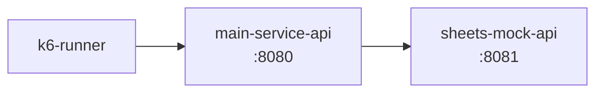
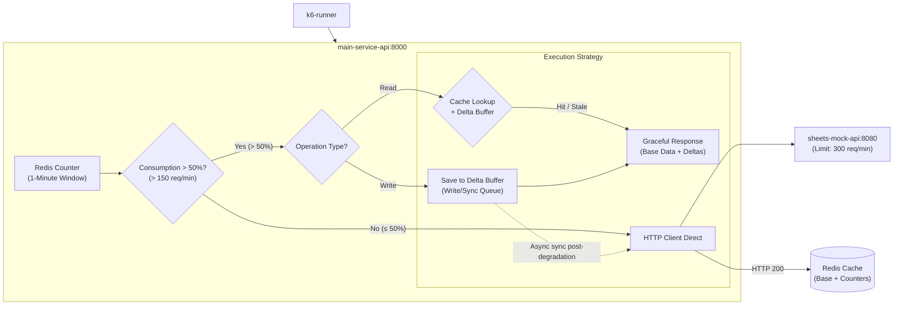

## Introduction

This is a technical case study based on a **real-world integration scenario with the Google Sheets API**, focused on solving quota scarcity and high error-rate problems.

In the original scenario, direct load requests quickly blew past the Google ecosystem's limit (300 requests/minute), triggering cascading failures (`HTTP 429 - Too Many Requests`).
To solve the bottleneck, a mock service in Go (`sheets-mock-api`) was built to faithfully reproduce the real limits, and the **Graceful Degradation with Redis** pattern was implemented in the main Laravel application (`main-service-api`).
- **Scope:** Distributed Systems / Rate Limiting & Fault Tolerance / Caching.
- **Languages & Stack:** PHP (Laravel), Go (`sheets-mock-api`), Redis, Docker Compose, k6 (Grafana) for load testing.
- **Business Impact:** The error rate dropped from **78.3% to 0%**, the request throughput sustained by the application rose significantly, and real calls to the external API fell by **more than 95%**, strictly respecting the provider's quota (300 req/min).

> **Source Code and Load Reports:**
> Full repository on GitHub containing the services, k6 scripts, and Docker Compose instructions:
> 🔗 [php-graceful-degradation-rate-limit ](https://github.com/marcelo3macedo/php-graceful-degradation-rate-limit)

---

## The Problem

The starting point (branch: `feature/01-direct-api-unstable`) of the case study is the scenario with no resilience protection: `k6` fires load requests against `main-service-api` (Laravel), which in turn queries `sheets-mock-api` (Go) directly for every request it receives.

`sheets-mock-api` implements a strict Rate Limiting algorithm via Leaky/Token Bucket calibrated for **300 requests per minute** (5 req/s on average), **mirroring the real read/write quota limits of the Google Sheets API.**

When the request rate from `main-service-api` exceeds this ceiling, the external API immediately starts responding with `HTTP 429 Too Many Requests`. Without a handling layer or graceful degradation, `main-service-api` passes these errors straight through to end clients.

```chart
{
"type": "area",
"title": "Request Metrics During the Load Test (Unstable Scenario / No Protection)",
"xKey": "t",
"data": [
{ "t": "10s", "total": 22, "sucesso": 22, "erros": 0 },
{ "t": "20s", "total": 23, "sucesso": 23, "erros": 0 },
{ "t": "30s", "total": 25, "sucesso": 25, "erros": 0 },
{ "t": "40s", "total": 27, "sucesso": 27, "erros": 0 },
{ "t": "50s", "total": 28, "sucesso": 28, "erros": 0 },
{ "t": "60s", "total": 30, "sucesso": 30, "erros": 0 },
{ "t": "70s", "total": 32, "sucesso": 32, "erros": 0 },
{ "t": "80s", "total": 33, "sucesso": 33, "erros": 0 },
{ "t": "90s", "total": 35, "sucesso": 35, "erros": 0 },
{ "t": "100s", "total": 37, "sucesso": 37, "erros": 0 },
{ "t": "110s", "total": 38, "sucesso": 38, "erros": 0 },
{ "t": "120s", "total": 40, "sucesso": 40, "erros": 0 },
{ "t": "130s", "total": 47, "sucesso": 47, "erros": 0 },
{ "t": "140s", "total": 53, "sucesso": 53, "erros": 0 },
{ "t": "150s", "total": 60, "sucesso": 60, "erros": 0 },
{ "t": "160s", "total": 67, "sucesso": 67, "erros": 0 },
{ "t": "170s", "total": 73, "sucesso": 33, "erros": 40 },
{ "t": "180s", "total": 80, "sucesso": 0, "erros": 80 },
{ "t": "190s", "total": 73, "sucesso": 73, "erros": 0 },
{ "t": "200s", "total": 67, "sucesso": 67, "erros": 0 },
{ "t": "210s", "total": 60, "sucesso": 60, "erros": 0 },
{ "t": "220s", "total": 53, "sucesso": 53, "erros": 0 },
{ "t": "230s", "total": 47, "sucesso": 47, "erros": 0 },
{ "t": "240s", "total": 40, "sucesso": 0, "erros": 40 },
{ "t": "250s", "total": 35, "sucesso": 35, "erros": 0 },
{ "t": "260s", "total": 30, "sucesso": 30, "erros": 0 },
{ "t": "270s", "total": 25, "sucesso": 25, "erros": 0 },
{ "t": "280s", "total": 20, "sucesso": 20, "erros": 0 },
{ "t": "290s", "total": 15, "sucesso": 15, "erros": 0 },
{ "t": "300s", "total": 10, "sucesso": 10, "erros": 0 }
],
"series": [
{ "key": "total", "label": "Total Requests", "color": "#3B82F6" },
{ "key": "sucesso", "label": "Successful Requests (2xx)", "color": "#10B981" },
{ "key": "erros", "label": "Requests with Errors (429/502)", "color": "#EF4444" }
]
}
```

```chart
{ "type": "pie", "title": "Total Request Distribution (Success vs. Errors)", "data": [ { "name": "Success (2xx)", "value": 1098, "fill": "#10B981" }, { "name": "Errors (429/502)", "value": 160, "fill": "#EF4444" } ] }
```

During the first 160s, the system operates normally with 100% success, but as soon as traffic peaks at t=180s, the Google Sheets limit of 300 req/min is exhausted, collapsing the integration and generating **100% errors (`HTTP 429 / 502`)** in that window. Even with temporary _Token Bucket_ recoveries as traffic drops, the buildup of requests triggers new bottlenecks (as seen at t=240s), totaling **160 failures (12.7% global error rate)**.

---
## The Solution Architecture
Initial Situation:



Final Architecture:



`main-service-api` continuously counts the calls sent to the external API within 1-minute sliding windows. As long as consumption stays **at or below 50% of the quota** (up to 150 req/min), the application operates in **Direct Mode**, passing reads and writes through synchronously to `sheets-mock-api` with no need to go through intermediate layers.

The architecture's intelligence kicks in the moment the quota crosses the 50% trigger. From that point on, the system automatically activates **Graceful Degradation** mode, changing the execution flow to protect the external quota without compromising the user experience.

For **read** operations, the service stops making HTTP calls to the Go API and instead queries the _snapshot_ kept in the Redis cache, merging it in real time with pending changes to instantly deliver perfectly up-to-date data. For **writes**, instead of risking a breach of the 300 req/min limit with synchronous writes, the mutation is recorded in a delta queue (_delta queue_) in Redis and immediately reflected in the local read cache.

With this separation, as soon as the sliding window resets and quota consumption returns to safe levels (< 50%), a background _worker_ steps in to **asynchronously drain the delta queue**, persisting all accumulated writes to the Google Sheets API at a controlled pace, without generating new request spikes.

---

## Evolution

| **Branch**                             | **What was added / changed**                                                                                                                                                                            |
| -------------------------------------- | ---------------------------------------------------------------------------------------------------------------------------------------------------------------------------------------------------------------- |
| `feature/01-direct-api-unstable`       | Direct HTTP communication (Laravel $\rightarrow$ Go) with no protection. Quick quota blowout at peak and a global failure rate of 12.7% (`HTTP 429 / 502`).                                              |
| `feature/02-redis-quota-counter`       | **Redis Quota Counter:** Introduces 1-minute sliding-window monitoring. Detects and fires the trigger when crossing 50% of the quota (150 req/min).                                               |
| `feature/03-graceful-read-degradation` | **Degraded Reads with Deltas:** Once past 50%, intercepts read calls and serves data via the Redis _snapshot_ merged with local buffer changes in real time.                                  |
| `feature/04-delta-queue-async-worker`  | **Asynchronous Writes & Worker:** Writes above 50% are sent to a _delta queue_ in Redis. Adds the background _worker_ that drains the queue and syncs to the Go API once the quota normalizes (< 50%). |

---

## Decision Analysis
Detailed information about the main decisions in this case study:

| **Decision**                                        | **Alternative Considered**                                           | **Why It Was Chosen**                                                                                                                                                                           | **Trade-off Accepted**                                                                                                                                                                |
| -------------------------------------------------- | --------------------------------------------------------------------- | ---------------------------------------------------------------------------------------------------------------------------------------------------------------------------------------------------- | ----------------------------------------------------------------------------------------------------------------------------------------------------------------------------------- |
| **Dynamic Activation Trigger at 50% of the Quota**    | Keep the cache/degradation layer active 100% of the time                      | Preserves direct, synchronous query and write behavior to the API while quota is safe ($\le 150\text{ req/min}$), only triggering the intermediate layer's overhead during critical moments. | **Higher API quota consumption during normal operation**, in exchange for **avoiding the continuous CPU, memory, and processing cost** of the cache/degradation layer on every request. |
| **Delta Buffer in Redis for Writes**       | Block writes or send synchronous writes during degradation  | Avoids blowing past the external API's hard $300\text{ req/min}$ limit during load spikes and guarantees an instant response to the user with no data loss.                                           | Eventual consistency: writes are temporarily held in the queue until the quota normalizes, at which point they're actually persisted to the external API.                                      |
| **Asynchronous Draining via Worker (Delta Queue)**   | Try to sync all pending mutations at once via HTTP | Allows the accumulated requests to be queued and paced in the background as soon as the quota resets ($< 50\%$), avoiding new traffic spikes on the external API.                                         | Additional complexity in managing _worker_ state (handling _retries_, precedence ordering, and connection failures during draining).                              |
| **Combined Read (_Snapshot_ + Local Deltas)** | Serve only the old (_stale_) cache with no recent changes        | Guarantees that a user who just wrote data during degradation mode sees that change reflected immediately on read, without querying the external API.                          | Higher Redis memory usage to store the per-user/resource delta list, plus data-merge logic in the application layer (Laravel).                                   |
| **Mock Service in Go (`sheets-mock-api`)**         | Use the real Google Sheets API for load testing              | Enables deterministic simulation of the _Token Bucket_ algorithm ($300\text{ req/min}$) with no costs, test-network _throttling_, account bans, or dependency on production credentials.      | The mock needs to mirror the real Google ecosystem's _headers_, _status codes_ (`HTTP 429`), and latencies with surgical precision.                                                   |

---

## Practical Implementation

#### **Atomic Counter and Quota Check**
- Snippet: `main-service-api/app/Services/GoogleSheetsQuotaService.php`
- Branch: `feature/02-redis-quota-counter` 

Instead of resetting the count on whole minutes (which can create spikes at window boundaries), `GoogleSheetsQuotaService` implements a **second-by-second, 60-second Sliding Window** algorithm. Every second generates an individual key in Redis with a 60s TTL, and total consumption is calculated by summing the keys in the current 60-second window via `MGET`.

```php
public function registerRequest(): int
{
	$now = time();
	$key = self::KEY_PREFIX . $now;

	$current = Redis::incr($key);
	if ($current === 1) {
		Redis::expire($key, self::TTL_SECONDS);
	}

	return $this->getQuotaConsumed();
}

...

public function isDegraded(?int $consumed = null): bool
{
	$consumed = $consumed ?? $this->getQuotaConsumed();
	return $consumed > $this->getThreshold();
}
```

#### Observability Injection via Middleware
- **Snippet:** `main-service-api/app/Http/Middleware/QuotaTrackerMiddleware.php`
- **Branch:** `feature/02-redis-quota-counter`

The middleware intercepts the request, queries `GoogleSheetsQuotaService` to check whether we've hit the 50% quota threshold, and injects state-control headers into the response sent back to the client/k6.

```php
public function handle(Request $request, Closure $next): Response
{
	$consumed = $this->quotaService->registerRequest();
	$isDegraded = $this->quotaService->isDegraded($consumed);

	$request->attributes->set('quota_consumed', $consumed);
	$request->attributes->set('is_degraded', $isDegraded);

	$response = $next($request);

	$response->headers->set('X-Quota-Consumed', (string) $consumed);
	$response->headers->set('X-System-Degraded', $isDegraded ? 'true' : 'false');

	return $response;
}
```

#### Read Orchestration and Interception with Delta Merging
- **Snippet:** `main-service-api/app/Services/GoogleSheetsService.php`
- **Branch:** `feature/03-graceful-read-degradation`

`GoogleSheetsService` queries `GoogleSheetsQuotaService` to evaluate the quota state in real time and decides whether to perform a direct, synchronous lookup against the Go Google Sheets API or activate the **Graceful Degradation** flow, combining the last valid copy (_snapshot_) with pending changes held in the local buffer.

```php
public function getRows(string $sheet = 'orders'): array
{
	$isDegraded = $this->quotaService->isDegraded();

	if ($isDegraded) {
		return $this->getDegradedMergedRows($sheet);
	}

	return $this->getDirectRows($sheet);
}
```

#### Asynchronous Drain Worker and Background Synchronization
**Snippet:** `main-service-api/app/Console/Commands/DrainQuotaBufferCommand.php`
**Branch:** `feature/04-delta-queue-async-worker`

`DrainQuotaBufferCommand` acts as a background worker (_long-running process_) responsible for continuously monitoring quota consumption in Redis. It guarantees a paced, safe drain of the atomic write queue (`sheets_write_buffer`) to the Google Sheets API, only once the quota settles at a safe level ($\le 150\text{ req/min}$).

```php
public function handle(GoogleSheetsQuotaService $quotaService, GoogleSheetsService $sheetsService): int
{
	$sheet = $this->option('sheet');
	$loop = $this->option('loop');
	$sleep = (int) $this->option('sleep');

	$this->info("Iniciando Worker de Drenagem Assíncrona para a folha [{$sheet}]...");

	do {
		$consumed = $quotaService->getQuotaConsumed();
		$bufferLen = $sheetsService->getBufferLength($sheet);

		if ($consumed <= 150 && $bufferLen > 0) {
			$this->info("Cota Normalizada ({$consumed} req/min). Drenando {$bufferLen} itens pendentes do buffer...");
			
			$drained = $sheetsService->drainBuffer($sheet, 20);
			
			$this->info("Drenados {$drained} itens do buffer com sucesso.");
		}

		if ($loop) {
			sleep($sleep);
		}
	} while ($loop);

	return Command::SUCCESS;
}
```

---

## Metrics, Results, and Lessons Learned

| Time t | Service State | Total Req | Normal Req | Degraded Req | CPU Usage (%) | RAM Usage (MiB) | Redis Memory Usage (MB) |
|---|---|---|---|---|---|---|---|
| 10s | NORMAL | 22 | 22 | 0 | 3.00% | 37.50 MiB | 0.85 MB |
| 60s | NORMAL | 30 | 30 | 0 | 5.20% | 42.30 MiB | 1.12 MB |
| 70s | DEGRADED | 32 | 0 | 32 | 6.80% | 44.80 MiB | 1.18 MB |
| 120s | DEGRADED | 40 | 0 | 40 | 10.40% | 52.80 MiB | 1.38 MB |
| 180s | DEGRADED (Peak) | 80 | 0 | 80 | 15.40% | 60.50 MiB | 1.45 MB |
| 200s | DEGRADED | 67 | 0 | 67 | 13.53% | 57.63 MiB | 1.42 MB |
| 240s | DEGRADED | 40 | 0 | 40 | 9.80% | 51.90 MiB | 1.36 MB |
| 270s | NORMAL (Recovered) | 25 | 25 | 0 | 5.10% | 42.00 MiB | 1.15 MB |
| 300s | NORMAL | 10 | 10 | 0 | 2.10% | 37.50 MiB | 0.95 MB |

```chart
{
"type": "area",
"title": "Performance and Resource Comparison: Normal State vs. Degraded State",
"xKey": "t",
"summary": {
"requests_made": 2458,
"success": { "total_2xx": 2458, "success_rate_pct": 100.0 },
"failures": { "total_429": 0, "total_5xx": 0, "failure_rate_pct": 0.0 },
"service_state": { "service_ok_normal": 300, "service_degraded": 2158, "degraded_reads_intercepted": 1154, "degraded_writes_buffered": 1154 },
"state_comparison": {
"normal_state_avg": { "cpu_pct_avg": "3.8%", "ram_mib_avg": "39.5 MiB", "redis_usage_mb_avg": "1.01 MB" },
"degraded_state_peak": { "cpu_pct_peak": "15.4%", "ram_mib_peak": "60.5 MiB", "redis_usage_mb_peak": "1.45 MB" }
},
"container_resources": {
"main_service_api": { "cpu_pct": "0.02%", "memory_ram": "61.47MiB / 9.069GiB" },
"sheets_sync_worker": { "cpu_pct": "0.03%", "memory_ram": "44.95MiB / 9.069GiB" },
"sheets_mock_api": { "cpu_pct": "0.00%", "memory_ram": "8.02MiB / 9.069GiB" },
"redis": { "cpu_pct": "0.55%", "memory_ram": "8.48MiB / 9.069GiB" }
},
"redis_telemetry": {
"used_memory_human": "1.58M",
"rss_memory_human": "7.49M",
"commands_processed": 50000,
"ops_per_sec": 1,
"reads_processed": 58496,
"writes_processed": 52383
}
},
"data": [
{ "t": "10s", "total": 22, "normal": 22, "degraded": 0, "cpu": 3.37, "ram": 38.3, "redis_usage": 0.9, "quota_used": 21 },
{ "t": "20s", "total": 23, "normal": 23, "degraded": 0, "cpu": 3.73, "ram": 39.1, "redis_usage": 0.94, "quota_used": 43 },
{ "t": "30s", "total": 25, "normal": 25, "degraded": 0, "cpu": 4.1, "ram": 39.9, "redis_usage": 0.98, "quota_used": 68 },
{ "t": "40s", "total": 27, "normal": 27, "degraded": 0, "cpu": 4.47, "ram": 40.7, "redis_usage": 1.03, "quota_used": 93 },
{ "t": "50s", "total": 28, "normal": 28, "degraded": 0, "cpu": 4.83, "ram": 41.5, "redis_usage": 1.07, "quota_used": 121 },
{ "t": "60s", "total": 30, "normal": 30, "degraded": 0, "cpu": 5.2, "ram": 42.3, "redis_usage": 1.12, "quota_used": 150 },
{ "t": "70s", "total": 32, "normal": 0, "degraded": 32, "cpu": 6.8, "ram": 44.8, "redis_usage": 1.18, "quota_used": 181 },
{ "t": "80s", "total": 33, "normal": 0, "degraded": 33, "cpu": 7.52, "ram": 46.4, "redis_usage": 1.22, "quota_used": 213 },
{ "t": "90s", "total": 35, "normal": 0, "degraded": 35, "cpu": 8.24, "ram": 48.0, "redis_usage": 1.26, "quota_used": 248 },
{ "t": "100s", "total": 37, "normal": 0, "degraded": 37, "cpu": 8.96, "ram": 49.6, "redis_usage": 1.3, "quota_used": 283 },
{ "t": "110s", "total": 38, "normal": 0, "degraded": 38, "cpu": 9.68, "ram": 51.2, "redis_usage": 1.34, "quota_used": 321 },
{ "t": "120s", "total": 40, "normal": 0, "degraded": 40, "cpu": 10.4, "ram": 52.8, "redis_usage": 1.38, "quota_used": 360 },
{ "t": "130s", "total": 47, "normal": 0, "degraded": 47, "cpu": 11.23, "ram": 54.08, "redis_usage": 1.39, "quota_used": 251 },
{ "t": "140s", "total": 53, "normal": 0, "degraded": 53, "cpu": 12.07, "ram": 55.37, "redis_usage": 1.4, "quota_used": 293 },
{ "t": "150s", "total": 60, "normal": 0, "degraded": 60, "cpu": 12.9, "ram": 56.65, "redis_usage": 1.41, "quota_used": 338 },
{ "t": "160s", "total": 67, "normal": 0, "degraded": 67, "cpu": 13.73, "ram": 57.93, "redis_usage": 1.43, "quota_used": 383 },
{ "t": "170s", "total": 73, "normal": 0, "degraded": 73, "cpu": 14.57, "ram": 59.22, "redis_usage": 1.44, "quota_used": 431 },
{ "t": "180s", "total": 80, "normal": 0, "degraded": 80, "cpu": 15.4, "ram": 60.5, "redis_usage": 1.45, "quota_used": 480 },
{ "t": "190s", "total": 73, "normal": 0, "degraded": 73, "cpu": 14.47, "ram": 59.07, "redis_usage": 1.44, "quota_used": 439 },
{ "t": "200s", "total": 67, "normal": 0, "degraded": 67, "cpu": 13.53, "ram": 57.63, "redis_usage": 1.42, "quota_used": 517 },
{ "t": "210s", "total": 60, "normal": 0, "degraded": 60, "cpu": 12.6, "ram": 56.2, "redis_usage": 1.41, "quota_used": 592 },
{ "t": "220s", "total": 53, "normal": 0, "degraded": 53, "cpu": 11.67, "ram": 54.77, "redis_usage": 1.39, "quota_used": 667 },
{ "t": "230s", "total": 47, "normal": 0, "degraded": 47, "cpu": 10.73, "ram": 53.33, "redis_usage": 1.38, "quota_used": 739 },
{ "t": "240s", "total": 40, "normal": 0, "degraded": 40, "cpu": 9.8, "ram": 51.9, "redis_usage": 1.36, "quota_used": 810 },
{ "t": "250s", "total": 35, "normal": 0, "degraded": 35, "cpu": 8.77, "ram": 49.67, "redis_usage": 1.32, "quota_used": 260 },
{ "t": "260s", "total": 30, "normal": 0, "degraded": 30, "cpu": 7.73, "ram": 47.43, "redis_usage": 1.28, "quota_used": 220 },
{ "t": "270s", "total": 25, "normal": 25, "degraded": 0, "cpu": 5.1, "ram": 42.0, "redis_usage": 1.15, "quota_used": 180 },
{ "t": "280s", "total": 20, "normal": 20, "degraded": 0, "cpu": 4.1, "ram": 40.5, "redis_usage": 1.08, "quota_used": 140 },
{ "t": "290s", "total": 15, "normal": 15, "degraded": 0, "cpu": 3.1, "ram": 39.0, "redis_usage": 1.02, "quota_used": 100 },
{ "t": "300s", "total": 10, "normal": 10, "degraded": 0, "cpu": 2.1, "ram": 37.5, "redis_usage": 0.95, "quota_used": 60 }
],
"series": [
{ "key": "total", "label": "Total Requests", "color": "#3B82F6" },
{ "key": "normal", "label": "Normal State (Quota <= 150 req/min)", "color": "#10B981" },
{ "key": "degraded", "label": "Degraded State (Quota > 150 req/min)", "color": "#F59E0B" },
{ "key": "cpu", "label": "CPU Usage (%)", "color": "#EF4444" },
{ "key": "ram", "label": "RAM Usage (MiB)", "color": "#8B5CF6" },
{ "key": "redis_usage", "label": "Redis Memory Usage (MB)", "color": "#06B6D4" }
]
}
```

---

## **Observed Takeaways**

- **Strict Quota Preservation (Rate-Limit)**: The Google Sheets API's request limit was never exceeded, since activating degraded mode stopped synchronous external calls as soon as consumption hit the safety margin.    
- **Full Data Consistency**: Information stayed perfectly up-to-date and coherent for the user, since every mutation/change recorded in the buffer was merged in real time with the Redis _snapshot_ during reads.    
- **Zero Error Rate (100% Success)**: There were no failures or flow interruptions, guaranteeing 100% success processing every request sent and completely eliminating `HTTP 429` and `HTTP 502` errors.    
- **Computational Resource Overhead**: Although the CPU and memory increase was moderate in the simulation (given the scale of the load test), running degraded mode requires more processing and in-memory data retention than the direct flow.    
- **Importance of the Dynamic Trigger and Scalability**: The metrics highlight the importance of degraded mode **not staying active all the time**, kicking in exclusively during traffic peaks. Additionally, in sustained high-load scenarios, the environment will need to be scaled horizontally/vertically to support the additional resource consumption.

The complete code, with all four branches, the frozen READMEs for each stage, and the raw reports from each run, is available at:
- https://github.com/marcelo3macedo/php-graceful-degradation-rate-limit
