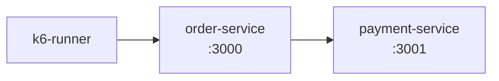
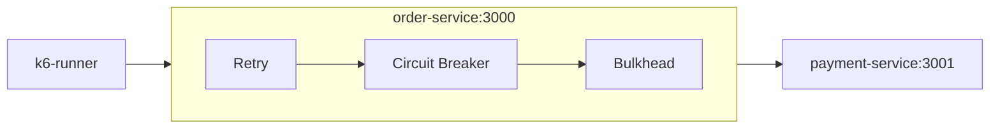

## Introduction

This is a resilience case study: the payment-service simulates a real memory leak that grows until it hits the container's memory limit, enters a crash-loop (OOM-kill + automatic restart) under sustained load, and the order-service evolved, branch by branch, to handle it: retry with exponential backoff and jitter, circuit breaker, and bulkhead.
- **Scope:** Distributed Systems / Partial Failure Tolerance.
- **Languages and Stack:** Node.js (Express), Docker Compose, [k6](https://k6.io/) (Grafana) for load testing.
- **Business Impact:** $p(95)$ latency dropped **14x (from 3005ms to 204ms)** and request throughput increased by **53%**. The system adopted a _Fail-Fast_ strategy, prioritizing protection of the _Event Loop_'s resources over retaining zombie calls.

> **Source Code and Load Reports:**
> Full repository on GitHub with the 4 evolutionary branches, the k6 scripts, and Docker Compose instructions:  
> 🔗 [github.com/marcelo3macedo/node-microservices-resilience-patterns](https://github.com/marcelo3macedo/node-microservices-resilience-patterns)

---

## The Problem

The starting point of this case study is the `feature/01-base-service-unstable` branch: k6 fires load requests against the `order-service`, which in turn calls the `payment-service` to confirm each order.
The catch is that the `payment-service` is an unstable service, with a **real memory leak** built in on purpose. Every request it receives allocates and retains a buffer, so the process's RSS (physical memory) grows continuously under load until it hits the container's memory limit (256MB), and Docker kills the process with an OOM (exit code 137).


```chart
{
  "type": "area",
  "title": "payment-service RAM during the test (2 leak → OOM-kill → restart cycles)",
  "xKey": "t",
  "data": [
    { "t": "2s", "ram": 62.1 }, { "t": "3s", "ram": 62.1 }, { "t": "4s", "ram": 62.14 },
    { "t": "5s", "ram": 59.63 }, { "t": "6s", "ram": 85.81 }, { "t": "7s", "ram": 60 },
    { "t": "8s", "ram": 62.49 }, { "t": "9s", "ram": 66.73 }, { "t": "10s", "ram": 71.25 },
    { "t": "11s", "ram": 79.02 }, { "t": "12s", "ram": 122.2 }, { "t": "13s", "ram": 97.93 },
    { "t": "14s", "ram": 109.7 }, { "t": "15s", "ram": 122 }, { "t": "16s", "ram": 138.4 },
    { "t": "17s", "ram": 152.4 }, { "t": "18s", "ram": 195.2 }, { "t": "19s", "ram": 190.8 },
    { "t": "20s", "ram": 212.3 }, { "t": "21s", "ram": 237 }, { "t": "22s", "ram": 216 },
    { "t": "23s", "ram": 245 }, { "t": "24s", "ram": 250.1 }, { "t": "25s", "ram": 250.9 },
    { "t": "26s", "ram": 250.7 }, { "t": "27s", "ram": 239.9 }, { "t": "28s", "ram": 250.8 },
    { "t": "29s", "ram": 248.4 }, { "t": "30s", "ram": 248.3 }, { "t": "32s", "ram": 27.27 },
    { "t": "33s", "ram": 27 }, { "t": "34s", "ram": 53.9 }, { "t": "35s", "ram": 106.6 },
    { "t": "36s", "ram": 164 }, { "t": "37s", "ram": 221.8 }, { "t": "38s", "ram": 217.1 },
    { "t": "39s", "ram": 251.3 }, { "t": "40s", "ram": 251.2 }, { "t": "41s", "ram": 251.2 },
    { "t": "42s", "ram": 251.3 }
  ],
  "series": [
    { "key": "ram", "label": "RAM (MiB) — 256MB limit", "color": "#EF4444" }
  ]
}
```

RAM climbs almost linearly to ~250MB, drops around t+31s (OOM-kill + restart), and climbs again until the end of the test.

The `order-service` simply forwards the call to the `payment-service` with a 3s timeout, with no protection whatsoever.
The result under load: **286 requests, 16.43% error rate, p(95) of 3004.54ms**, with the timeout being hit in almost 1 out of every 6 orders, concentrated exactly in the window where the `payment-service`'s memory is at its limit.

---
## Solution Architecture
Initial situation:



Final architecture:



The `order-service` is the gateway that calls the `payment-service` synchronously over HTTP. Across four branches, it gained layers of protection:

| Branch                                                                                                                                                          | What was added                                                                        |
| ----------------------------------------------------------------------------------------------------------------------------------------------------------------- | --------------------------------------------------------------------------------------- |
| [`feature/01-base-service-unstable`](https://github.com/marcelo3macedo/node-microservices-resilience-patterns/tree/feature/01-base-service-unstable)           | Base scenario: `payment-service` with a real memory leak, no protection whatsoever      |
| [`feature/02-pattern-retry-backoff`](https://github.com/marcelo3macedo/node-microservices-resilience-patterns/tree/feature/02-pattern-retry-backoff)           | Retry with exponential backoff + jitter, and `restart: on-failure` on `payment-service` |
| [`feature/03-pattern-circuit-breaker`](https://github.com/marcelo3macedo/node-microservices-resilience-patterns/tree/feature/03-pattern-circuit-breaker)       | Circuit breaker: fails fast when `payment-service` is degraded                          |
| [`feature/04-pattern-bulkhead-isolation`](https://github.com/marcelo3macedo/node-microservices-resilience-patterns/tree/feature/04-pattern-bulkhead-isolation) | Bulkhead: caps concurrent calls, isolating the event loop                               |

---

## Decision Analysis

Detailed information on the main decisions in this case study:

| **Decision**                                                              | **Alternative Considered**                               | **Why It Was Chosen**                                                                                                       | **Trade-off Accepted**                                                                                                          |
| ------------------------------------------------------------------------ | --------------------------------------------------------- | --------------------------------------------------------------------------------------------------------------------------- | --------------------------------------------------------------------------------------------------------------------------------- |
| **Synchronous HTTP Communication** _(with Retry + Circuit Breaker + Bulkhead)_ | Asynchronous Messaging _(SQS/RabbitMQ + Outbox Pattern)_ | Isolate and measure resilience patterns in synchronous flows, without the eventual-consistency layer that queues add.       | No 100% delivery guarantee. Unavailability produces a fast failure (_fail-fast_) instead of deferred reprocessing.               |
| **Circuit Breaker window set to 1500ms** _(reduced from the default 3000ms)_ | Keep the default 3000ms window                            | The `payment-service` container recovers in ~1-2s after a restart. The shorter window transitions to _Half-Open_ faster.    | Slight risk of firing a test request (_Half-Open_) while the target service is still finishing startup.                          |
| **Retry limited to 3 attempts** _(1000ms backoff cap)_                    | More attempts / higher backoff cap                        | Avoid holding the client in the Event Loop for too long during _Crash-Loop_ scenarios in the service.                       | Requests that would have recovered on a 4th attempt fail early.                                                                    |

**When applying the Circuit Breaker, why did the error rate rise from 2.58% to 7.84%?**

Looking at the data in the Metrics and Results section, the absolute error rate increased from the earlier branches (2.58% in `retry+backoff`) to the more advanced ones (7.84% in `circuit-breaker` and 7.00% in `bulkhead`).

**This is not a regression**, but rather the expected behavior of the **Circuit Breaker** and **Bulkhead** patterns:
- **Fail-Fast vs. Holding Connections:** Instead of keeping requests stuck waiting for an unstable service's timeout (which would exhaust `order-service`'s resources), the architecture opts to **reject calls quickly**.
- **The Positive Impact:** Even though the raw error count goes up, **$p(95)$ latency drops drastically**, freeing up the application's CPU/memory to keep serving healthy traffic from other modules.

In high-availability systems, failing fast to protect the overall health of the cluster is preferable to trying to save individual requests at any cost.

---

## Practical Implementation

### **Retry with exponential backoff and jitter**
- File: `order-service/utils/retry.js`
- Branch: `feature/02-pattern-retry-backoff`

Jitter prevents multiple requests from retrying at the exact same instant against a service that just came back up:

```js
function backoffDelay(attempt, baseDelayMs, maxDelayMs) {
  const exponential = Math.min(maxDelayMs, baseDelayMs * 2 ** attempt);
  return Math.random() * exponential;
}

if (response.ok || !isRetryableStatus(response.status) || isLastAttempt) {
  return response;
}
const delay = backoffDelay(attempt, baseDelayMs, maxDelayMs);
await sleep(delay);
```

### **Circuit breaker**
- File: `order-service/utils/circuit-breaker.js`
- Branch: `feature/03-pattern-circuit-breaker`

The CLOSED → OPEN → HALF_OPEN state machine is the "magic" of the pattern: while open, `canAttempt()` cuts off the call without even touching the `payment-service`:

```js
canAttempt() {
  if (this.state !== STATE.OPEN) return true;
  if (Date.now() - this.openedAt >= this.openDurationMs) {
    this.state = STATE.HALF_OPEN;
    return true;
  }
  return false;
}

onFailure() {
  this.failureCount += 1;
  const shouldOpen = this.state === STATE.HALF_OPEN || this.failureCount >= this.failureThreshold;
  if (shouldOpen) {
    this.state = STATE.OPEN;
    this.openedAt = Date.now();
    this.failureCount = 0;
  }
}
```

### **Bulkhead**
- File: `order-service/utils/bulkhead.js`
- Branch: `feature/04-pattern-bulkhead-isolation`

A simple counter of active calls; with no queue configured, the excess is rejected immediately instead of waiting:

```js
async run(fn) {
  if (this.active >= this.maxConcurrent) {
    if (this.queue.length >= this.maxQueue) {
      throw new BulkheadRejectedError(
        `Bulkhead "${this.name}" full (${this.active}/${this.maxConcurrent} running, ${this.queue.length}/${this.maxQueue} queued)`
      );
    }
    await new Promise((resolve) => this.queue.push(resolve));
  }
  this.active += 1;
  try { return await fn(); } finally { this.active -= 1; }
}
```

---

## Metrics, Results, and Lessons Learned

Numbers for each run (one per branch) are detailed in each branch's `results/report.txt` and `results/k6-summary.json` files.

| Branch          | Requests (req/s) | Error % | p50     | p90       | p95       | Max       |
| --------------- | ------------------- | ------ | ------- | --------- | --------- | --------- |
| Base            | 286 (8.16)          | 16.43% | 33.11ms | 3002.77ms | 3004.54ms | 3034.73ms |
| Retry           | 388 (11.03)         | 2.58%  | 16.70ms | 467.80ms  | 1148.36ms | 2432.52ms |
| Circuit Breaker | 459 (13.00)         | 7.84%  | 11.73ms | 196.96ms  | 399.79ms  | 1370.63ms |
| Bulkhead        | 443 (12.56)         | 7.00%  | 16.08ms | 105.03ms  | 204.89ms  | 2561.69ms |

```chart
{
  "type": "line",
  "title": "Latency (ms) by percentile, per branch",
  "xKey": "branch",
  "data": [
    { "branch": "01 - Base", "p50": 33.11, "p90": 3002.77, "p95": 3004.54 },
    { "branch": "02 - Retry", "p50": 16.70, "p90": 467.80, "p95": 1148.36 },
    { "branch": "03 - + Circuit Breaker", "p50": 11.73, "p90": 196.96, "p95": 399.79 },
    { "branch": "04 - + Bulkhead", "p50": 16.08, "p90": 105.03, "p95": 204.89 }
  ],
  "series": [
    { "key": "p50", "label": "p50 (median)", "color": "#10B981" },
    { "key": "p90", "label": "p90", "color": "#F59E0B" },
    { "key": "p95", "label": "p95", "color": "#EF4444" }
  ]
}
```

```chart
{
  "type": "bar",
  "title": "HTTP error rate (%) per branch",
  "xKey": "branch",
  "data": [
    { "branch": "01 - Base", "erro": 16.43 },
    { "branch": "02 - Retry", "erro": 2.58 },
    { "branch": "03 - + Circuit Breaker", "erro": 7.84 },
    { "branch": "04 - + Bulkhead", "erro": 7.00 }
  ],
  "series": [
    { "key": "erro", "label": "Error rate (%)", "color": "#EF4444" }
  ]
}
```

```chart
{
  "type": "bar",
  "title": "Confirmed vs. failed orders, per branch",
  "xKey": "branch",
  "stacked": true,
  "data": [
    { "branch": "01 - Base", "sucesso": 239, "erro": 47 },
    { "branch": "02 - Retry", "sucesso": 378, "erro": 10 },
    { "branch": "03 - + Circuit Breaker", "sucesso": 423, "erro": 36 },
    { "branch": "04 - + Bulkhead", "sucesso": 412, "erro": 31 }
  ],
  "series": [
    { "key": "sucesso", "label": "Success (201)", "color": "#10B981" },
    { "key": "erro", "label": "Failure (502/503)", "color": "#EF4444" }
  ]
}
```

```chart
{
  "type": "bar",
  "title": "Throughput (requests/s), per branch",
  "xKey": "branch",
  "data": [
    { "branch": "01 - Base", "rps": 8.16 },
    { "branch": "02 - Retry", "rps": 11.03 },
    { "branch": "03 - + Circuit Breaker", "rps": 13.00 },
    { "branch": "04 - + Bulkhead", "rps": 12.56 }
  ],
  "series": [
    { "key": "rps", "label": "req/s", "color": "#3B82F6" }
  ]
}
```

In the last branch, with all three patterns active at the same time, you can see exactly which mechanism intercepted each type of degradation:

```chart
{
  "type": "bar",
  "title": "Resilience mechanisms triggered on branch 04 (by event)",
  "xKey": "mecanismo",
  "data": [
    { "mecanismo": "Bulkhead: immediate rejection (503)", "eventos": 19 },
    { "mecanismo": "Circuit breaker: fail-fast", "eventos": 5 },
    { "mecanismo": "Retry: attempts fired", "eventos": 11 }
  ],
  "series": [
    { "key": "eventos", "label": "Events", "color": "#7C3AED" }
  ]
}
```

---

## **Observations**

- **Retry + automatic restart are a combo, not isolated pieces:** of the 26 calls that failed on the first attempt in the (retry-backoff) branch, 16 were saved because the next attempt already hit the restarted `payment-service`. Retry alone wouldn't save a sustained outage.
- **p(95) latency dropped 14x (3005ms → 205ms)**, but not monotonically across every metric: the **maximum** latency of the (bulkhead) branch (2562ms) is higher than that of the (circuit-breaker) branch (1371ms), because the bulkhead with no queue lets anything not rejected go straight through, even if the `payment-service` happens to be in a bad moment of its memory cycle.
- Why did Maximum Latency rise in Bulkhead (2562 ms) compared to Circuit Breaker (1371 ms)?
	- The difference between the maximum latencies comes from how each pattern handles calls to a degraded service (`payment-service` mid-memory-bottleneck cycle):
		- **Circuit Breaker (_Fail-Fast_):** Upon detecting the error rate, the circuit "opens" and starts rejecting calls **immediately** (within a few milliseconds), without even forwarding them to the target service. Since no request waits on the slow processing of the unstable service, the recorded maximum latency stays low (**1371 ms**).
		- **Bulkhead Without a Queue (Limited Concurrency):** The Bulkhead only limits how many calls run simultaneously (e.g., a maximum of 10).
		    - **Overflow (11th onward):** Rejected instantly with a `503` error.
		    - **Allowed (the first 10):** Get through to the payment service. However, if the service happens to be extremely slow (about to run Out Of Memory), those few allowed requests sit waiting for a response, which drives the isolated maximum latency up to **2562 ms**.
- **Error rate isn't the metric that should be optimized in isolation.** The (circuit-breaker and bulkhead) branches accept more errors (7.84% / 7.00%) than the (retry backoff) branch (2.58%) in exchange for much more predictable latency and isolation between services. The right call depends on what the business values more: fewer failed orders, or a system that never jams up in a cascade.
- **Delivery guarantee is a different architectural problem.** None of these three patterns delivers 100% of orders under a sustained `payment-service` outage — that would require an asynchronous layer (queue/outbox), outside the scope of this case study.

The full code, with the four branches, the frozen READMEs for each stage, and the raw reports from each run, is at:
- [github.com/marcelo3macedo/node-microservices-resilience-patterns](https://github.com/marcelo3macedo/node-microservices-resilience-patterns).
