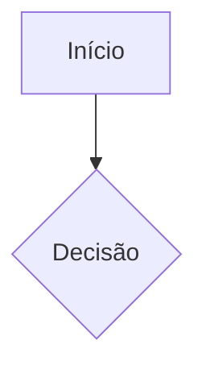
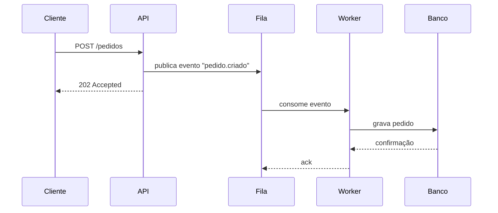
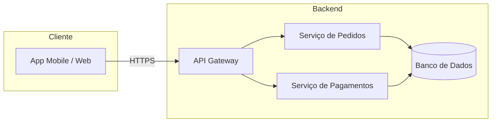

## Introdução

Este arquivo demonstra o formato esperado para posts escritos no Obsidian.


## Como funciona

Escreva o post no Obsidian normalmente. Coloque as imagens na pasta `obsidian/images/` com o mesmo nome usado no markdown.

Depois rode:

```bash
python sync_obsidian.py
```

O script cuida de tudo:
- Copia as imagens para `public/uploads/`
- Cria ou atualiza o post no banco
- Cria tags automaticamente se não existirem

## Dry run

Para ver o que seria sincronizado sem alterar nada:

```bash
python sync_obsidian.py --dry-run
```

## Categorias disponíveis

| Slug | Nome |
|------|------|
| `tecnologia` | Tecnologia |
| `desenvolvimento-web` | Desenvolvimento Web |
| `vida-pessoal` | Vida Pessoal |
| `produtividade` | Produtividade |

> Reenviar o mesmo arquivo atualiza o post existente — o slug é a chave.

## Campos de SEO

Três campos opcionais no frontmatter controlam o SEO da página do post:

| Campo | Uso | Fallback se ausente |
|-------|-----|----------------------|
| `seo_title` | `<title>` e `og:title`/`twitter:title` | `title` |
| `seo_description` | `<meta name="description">` e `og:description` | `excerpt` |
| `seo_keywords` | `<meta name="keywords">` (lista ou string) | nenhum |

> Não inclua "— além do script" no `seo_title`: o layout já adiciona o nome do site automaticamente em todas as páginas.

## Diagramas com Mermaid

O blog renderiza diagramas [Mermaid](https://mermaid.js.org) automaticamente: basta usar um bloco de código com a linguagem `mermaid`. Nenhuma configuração extra é necessária no frontmatter — o `MarkdownRenderer` detecta o bloco e desenha o diagrama como SVG no navegador, já adaptado ao tema claro/escuro do site.

````markdown

````

### Exemplo: diagrama de sequência

Útil para mostrar a ordem de chamadas entre serviços, como uma requisição passando por API, fila e banco de dados.



### Exemplo: diagrama de arquitetura

Útil para mostrar como os componentes de um sistema se conectam.



> Dica: prefira `graph LR` (esquerda→direita) para arquiteturas largas e `graph TD` (topo→baixo) para fluxos verticais. Tipos suportados incluem `sequenceDiagram`, `graph`/`flowchart`, `classDiagram`, `stateDiagram-v2`, `erDiagram`, entre outros — veja a [documentação do Mermaid](https://mermaid.js.org/intro/) para a sintaxe completa.

## Gráficos com Recharts

O blog também renderiza gráficos nativamente (sem imagem estática) usando um bloco de código com a linguagem `chart`, contendo um JSON de configuração. O `MarkdownRenderer` reconhece o bloco e desenha o gráfico com [Recharts](https://recharts.org), já adaptado ao tema claro/escuro do site.

Campos do JSON:

| Campo | Obrigatório | Descrição |
|-------|:---:|-----------|
| `type` | sim | `"line"`, `"bar"`, `"area"` ou `"pie"` |
| `data` | sim | lista de objetos, um por ponto/categoria do eixo X |
| `series` | sim | lista de `{ "key", "label"?, "color"? }` — quais campos de `data` viram linhas/barras |
| `xKey` | não | campo usado no eixo X (padrão: `"name"`) |
| `title` | não | título exibido acima do gráfico |
| `stacked` | não | `true` empilha barras/áreas em vez de sobrepô-las |

### Exemplo: latência antes e depois de um circuit breaker

Gráfico de linha, útil para comparar percentis de latência (p50/p95/p99) em um cenário de concorrência sob carga.

````markdown
```chart
{
  "type": "line",
  "title": "Latência (ms) por percentil durante pico de tráfego",
  "xKey": "minuto",
  "data": [
    { "minuto": "0", "p50": 42, "p95": 110, "p99": 180 },
    { "minuto": "5", "p50": 45, "p95": 340, "p99": 920 },
    { "minuto": "10", "p50": 48, "p95": 610, "p99": 1500 },
    { "minuto": "15", "p50": 44, "p95": 130, "p99": 210 },
    { "minuto": "20", "p50": 43, "p95": 115, "p99": 190 }
  ],
  "series": [
    { "key": "p50", "label": "p50", "color": "#7C3AED" },
    { "key": "p95", "label": "p95", "color": "#F59E0B" },
    { "key": "p99", "label": "p99", "color": "#EF4444" }
  ]
}
```
````

```chart
{
  "type": "line",
  "title": "Latência (ms) por percentil durante pico de tráfego",
  "xKey": "minuto",
  "data": [
    { "minuto": "0", "p50": 42, "p95": 110, "p99": 180 },
    { "minuto": "5", "p50": 45, "p95": 340, "p99": 920 },
    { "minuto": "10", "p50": 48, "p95": 610, "p99": 1500 },
    { "minuto": "15", "p50": 44, "p95": 130, "p99": 210 },
    { "minuto": "20", "p50": 43, "p95": 115, "p99": 190 }
  ],
  "series": [
    { "key": "p50", "label": "p50", "color": "#7C3AED" },
    { "key": "p95", "label": "p95", "color": "#F59E0B" },
    { "key": "p99", "label": "p99", "color": "#EF4444" }
  ]
}
```

O pico de p95/p99 entre os minutos 5 e 10 é justamente a janela em que o circuit breaker deveria abrir para proteger o serviço downstream.

### Exemplo: requisições concorrentes — sucesso vs. erro

Gráfico de barras empilhadas (`"stacked": true`), útil para mostrar a proporção de falhas sob concorrência alta.

````markdown
```chart
{
  "type": "bar",
  "title": "Requisições simultâneas por worker",
  "xKey": "worker",
  "stacked": true,
  "data": [
    { "worker": "worker-1", "sucesso": 320, "erro": 12 },
    { "worker": "worker-2", "sucesso": 298, "erro": 45 },
    { "worker": "worker-3", "sucesso": 310, "erro": 8 },
    { "worker": "worker-4", "sucesso": 275, "erro": 60 }
  ],
  "series": [
    { "key": "sucesso", "label": "Sucesso", "color": "#10B981" },
    { "key": "erro", "label": "Erro", "color": "#EF4444" }
  ]
}
```
````

```chart
{
  "type": "bar",
  "title": "Requisições simultâneas por worker",
  "xKey": "worker",
  "stacked": true,
  "data": [
    { "worker": "worker-1", "sucesso": 320, "erro": 12 },
    { "worker": "worker-2", "sucesso": 298, "erro": 45 },
    { "worker": "worker-3", "sucesso": 310, "erro": 8 },
    { "worker": "worker-4", "sucesso": 275, "erro": 60 }
  ],
  "series": [
    { "key": "sucesso", "label": "Sucesso", "color": "#10B981" },
    { "key": "erro", "label": "Erro", "color": "#EF4444" }
  ]
}
```

> Para uma pizza de distribuição (ex: motivos de falha), use `"type": "pie"` — nesse caso `series` precisa de apenas uma entrada (a chave numérica de `data`) e `xKey` vira o nome de cada fatia.
