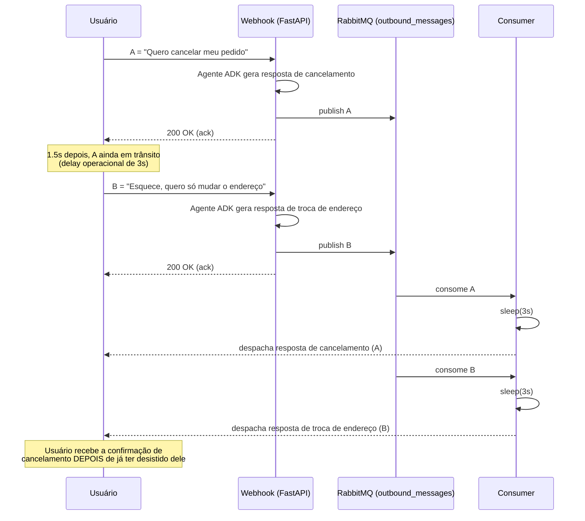
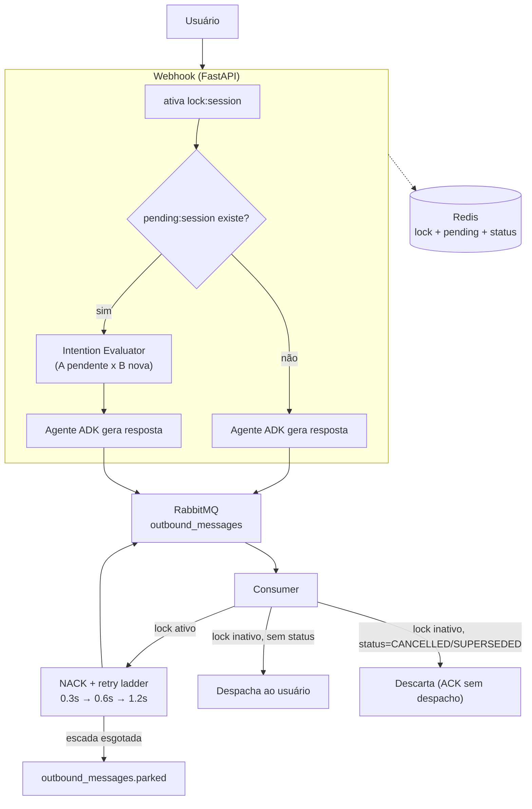
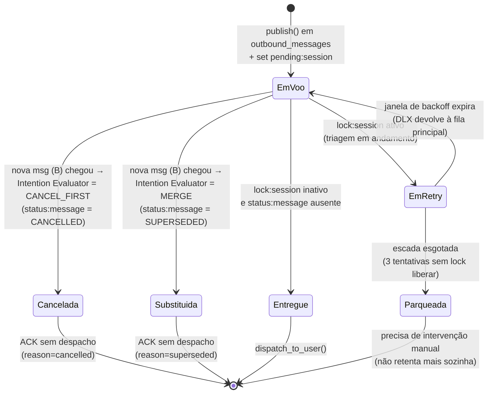
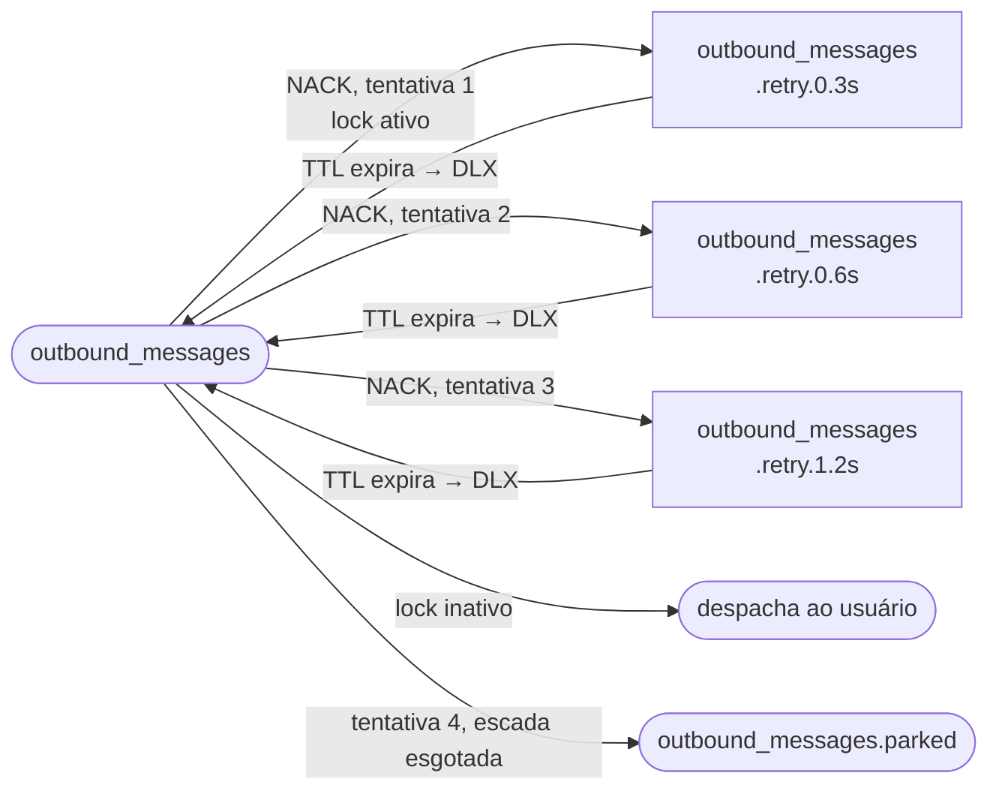

## Introdução

Este artigo apresenta um estudo de caso completo sobre o **gerenciamento de estado concorrente em Agentes de IA conversacionais**.
Em aplicações de mensageria de alto volume (como WhatsApp, Telegram ou webchats), é comum o usuário enviar múltiplas mensagens em sequência (mensagem A seguida da mensagem B em um curto intervalo de tempo) antes que a primeira resposta seja gerada e entregue.
Sem um controle arquitetural de concorrência, o sistema sofre com consumo duplicado de tokens em LLMs, desincronização de contexto e entrega de respostas contraditórias ou fora de ordem.
- **Escopo:** Estado Concorrente / Debounce de Mensagens em Agentes de IA.
- **Linguagens e Stack:** Python, FastAPI, Google ADK, Redis, RabbitMQ.
- **Impacto de Negócio:** Elimina o envio de respostas desatualizadas ou contraditórias, reduz o desperdício de tokens em chamadas redundantes a LLMs e garante semântica de entrega previsível sob alto tráfego.

> **Código Fonte**
> Repositório completo no GitHub contendo as branches evolutivas, os scripts de simulação e as instruções do Docker Compose:
> 🔗 https://github.com/marcelo3macedo/gerenciamento-estado-concorrente-no-adk

---

## O Problema

Em sistemas conversacionais baseados em agentes de Inteligência Artificial, o comportamento real dos usuários em canais de mensageria (como WhatsApp, Telegram ou Webchat) difere drasticamente do modelo tradicional de requisição-resposta síncrona do protocolo HTTP.
Os usuários interagem de forma fluida e frequentemente enviam mensagens em rajadas curtas e sequenciais (_rapid-fire messaging_).
Por exemplo:
- um cliente pode enviar uma primeira mensagem A (_"Quero cancelar meu pedido 10"_)
- e, logo em seguida, antes mesmo que a resposta da mensagem A seja entregue ou enquanto ela ainda trafega na rede/fila de despacho,
- enviar uma segunda mensagem B (_"Esquece, na verdade quero só mudar o endereço"_).

Quando a arquitetura do agente opera de forma assíncrona desacoplada, onde um webhook recebe cada mensagem de forma isolada, dispara a inferência na LLM e enfileira a resposta em um corretor de mensagens com delay operacional, surge uma **condição de corrida (_race condition_) e falha no gerenciamento de estado**.

  




O problema manifesta-se em três dimensões críticas:

**Inconsistência Semântica e Respostas Contraditórias**
Como a mensagem A já iniciou seu ciclo de vida no agente, o sistema gera a confirmação de cancelamento e a envia para a fila de saída. 
Quando a mensagem B chega 1,5 segundo depois, o agente gera a resposta de alteração de endereço e a enfileira em seguida.
No canal do usuário, contudo, a resposta de cancelamento referente a A é entregue _depois_ que o cliente já havia desistido do cancelamento, gerando ruído e desconfiança.

**Desperdício Computacional e Financeiro**
O agente consome recursos computacionais relevantes e tokens de entrada/saída na API do modelo (LLM) para processar e gerar a resposta da mensagem A, ignorando que o contexto do diálogo foi completamente invalidado segundos depois pela mensagem B.

**Quebra na Experiência do Usuário (UX)**
A sobreposição de bolhas de conversa fora de ordem viola a expectativa conversacional esperada em assistentes virtuais de nível corporativo.

---
## A Arquitetura da Solução

Para sanar a condição de corrida, a arquitetura utiliza o **Redis como gerenciador de travas distribuídas** atrelado ao identificador da sessão e o **RabbitMQ como fila de despacho assíncrono**.
Sempre que uma nova mensagem entra no sistema enquanto uma resposta anterior ainda está sendo processada ou aguardando envio na fila de saída, o Redis sinaliza uma trava ativa.
Esse bloqueio intercepta o consumidor do RabbitMQ, impedindo que a mensagem em trânsito seja despachada ao usuário até que um agente avaliador determine se a resposta anterior deve ser liberada, cancelada ou fundida com a nova entrada.




Ao longo de três branches, o `order-service` foi ganhando as camadas necessárias para tratar essa concorrência como um problema de primeira classe, não como um bug a esconder:

| Branch                                                                                                                                                                                          | O que foi adicionado                                                                                               |
| ----------------------------------------------------------------------------------------------------------------------------------------------------------------------------------------------- | ------------------------------------------------------------------------------------------------------------------ |
| [`feature/01-naive-fastapi-rabbitmq-delay`](https://github.com/marcelo3macedo/gerenciamento-estado-concorrente-no-adk/tree/feature/01-naive-fastapi-rabbitmq-delay)                             | Cenário base: webhook + agente ADK + fila de saída com delay operacional, sem nenhuma proteção contra concorrência |
| [`feature/02-redis-lock-rabbitmq-exponential-backoff`](https://github.com/marcelo3macedo/gerenciamento-estado-concorrente-no-adk/tree/feature/02-redis-lock-rabbitmq-exponential-backoff)       | Trava de sessão no Redis + escada de retry com backoff exponencial no consumer via DLX do RabbitMQ                 |
| [`feature/03-google-adk-intent-evaluator-triage`](https://github.com/marcelo3macedo/gerenciamento-estado-concorrente-no-adk/tree/feature/03-google-adk-intent-evaluator-triage)                 | **Intention Evaluator** decide RELEASE_FIRST / CANCEL_FIRST / MERGE                                                |
| [`feature/04-e2e-simulative-tests-pytest-testcontainers`](https://github.com/marcelo3macedo/gerenciamento-estado-concorrente-no-adk/tree/feature/04-e2e-simulative-tests-pytest-testcontainers) | Suíte E2E com testcontainers                                                                                       |

---
## Situação das mensagens durante o processamento

Este é o núcleo do case: uma mensagem publicada em `outbound_messages` não é só "entregue ou não entregue", ela transita por um pequeno conjunto de estados, guardados em duas estruturas no Redis e consultados pelo consumer a cada tentativa de despacho.

  



  

A trava e o estado por mensagem resolvem perguntas diferentes:
- a trava diz *"espera, essa sessão está em triagem"*
- o estado diz *o que fazer* com a mensagem retida quando a triagem termina.

---
### A escada de retry
Enquanto a trava está ativa, o consumer não faz polling nem mantém a mensagem em memória, ele faz `NACK` e republica numa fila de atraso com TTL, crescente a cada tentativa:
  


O timeline abaixo é dado real, extraído dos logs de uma execução da suíte: uma trava que nunca é liberada faz a mensagem esgotar as 3 tentativas e ir parar em `outbound_messages.parked`, sem nunca chegar ao usuário e sem retentar para sempre:

```chart

{

"type": "line",

"title": "Timeline real: mensagem parqueada (trava nunca liberada)",

"xKey": "evento",

"data": [

{ "evento": "t=0.00s\npublish + 1ª tentativa", "elapsed": 0.00 },

{ "evento": "t=0.60s\ndelay operacional + rejeição #1", "elapsed": 0.60 },

{ "evento": "t=0.90s\nrejeição #2", "elapsed": 0.90 },

{ "evento": "t=1.51s\nrejeição #3", "elapsed": 1.51 },

{ "evento": "t=2.71s\nparked (attempts=3)", "elapsed": 2.71 }

],

"series": [

{ "key": "elapsed", "label": "Tempo decorrido (s)", "color": "#EF4444" }

]

}

```

- **0,00s — Publicação e 1ª Tentativa**: A resposta é gerada e postada na fila de saída do RabbitMQ.    
- **0,60s — Delay Operacional e Rejeição #1**: O _consumer_ pega a mensagem após o tempo de transporte (0,60s) e consulta o Redis. Como a trava continua ativa, ele aplica um `NACK` (rejeição) e coloca a mensagem em uma fila de retentativa (_backoff_) com pausa de 0,3s.    
- **0,90s — Rejeição #2**: Passados os 0,3s de pausa (0,60s + 0,30s = 0,90s), o _consumer_ tenta entregar a mensagem novamente. A trava no Redis continua presa. Ele rejeita de novo e aplica a próxima pausa da escada, agora de 0,6s.    
- **1,51s — Rejeição #3**: Passados os 0,6s de pausa (0,90s + 0,60s = 1,50s/1,51s), ocorre a terceira tentativa. Como a trava continua ativa, o sistema aplica o último nível da escada de atraso, de 1,2s.    
- **2,71s — Parqueamento (_Parked_)**: Passados os 1,2s da última pausa (1,51s + 1,20s = 2,71s), o sistema identifica que esgotou o limite de 3 retentativas sem que a trava fosse liberada. A mensagem é então movida para a fila `outbound_messages.parked`.

Isso impede que mensagens presas fiquem sendo reprocessadas indefinitivamente, o que consumiria CPU e memória do servidor sem necessidade.

---

## Análise de Decisão

Informações detalhada sobre as principais decisões deste case:

| **Decisão**                                                                                                                     | **Alternativa Considerada**                                         | **Por que foi Escolhida?**                                                                                                                                       | **Trade-off Aceito**                                                                                                                           |
| ------------------------------------------------------------------------------------------------------------------------------- | ------------------------------------------------------------------- | ---------------------------------------------------------------------------------------------------------------------------------------------------------------- | ---------------------------------------------------------------------------------------------------------------------------------------------- |
| **Liberação explícita da trava** ao fim da triagem, TTL só como rede de segurança                                               | Confiar só no TTL da trava (5s) para liberar a sessão               | Reter a trava até o TTL expirar faria toda mensagem em voo esperar até 5s mesmo quando a triagem termina em milissegundos — desnecessário na maioria dos casos.  | Se o processo do webhook morrer entre ativar a trava e liberá-la, a mensagem fica retentando (backoff) até a trava expirar por TTL             |
| **Matriz de decisão via 2º agente ADK** (`output_schema=IntentionDecision`, sem tools, sessão efêmera)                          | Heurística determinística (palavras-chave, similaridade de texto)   | Distinguir "cancela" de "não cancela, esquece" exige entender a intenção da frase, não só presença de palavras.                                                  | Cada colisão (B chegando com A ainda em voo) soma uma chamada de LLM extra à latência de B, e o custo de uma segunda sessão ADK por avaliação. |
| **Retry com backoff limitado a 3 tentativas + fila de parking**                                                                 | Retry infinito até a trava liberar                                  | Uma trava que nunca libera (crash do webhook) não pode virar uma mensagem retentando para sempre e consumindo o consumer.                                        | Mensagens parqueadas não são reentregues automaticamente; exigem intervenção manual ou um processo separado de reprocessamento.                |
| **Entrega assíncrona via RabbitMQ** (webhook publica, consumer despacha) em vez de resposta síncrona no `POST /webhook/message` | Devolver a resposta do agente diretamente no corpo da resposta HTTP | Necessário para simular e testar o delay operacional de um canal real, e para a trava fazer sentido — sem uma fila, não existe "mensagem em voo" para reavaliar. | Latência adicional (o delay operacional) entre a geração da resposta e a entrega, mesmo no caminho feliz sem colisão nenhuma.                  |


---

## Casos exemplificados

 `scripts/simulate_intention_triage.py` reproduz as 3 rotas de decisão via HTTP, cada uma numa sessão própria. Os tempos abaixo são reais, extraídos dos logs da suíte E2E, com A e B separados por ~0,3s, dentro da janela de delay operacional de 0,6s configurada para os testes:

 **Decisão 1 — RELEASE_FIRST** (B não conflita com A)
A = *"Qual o horário de funcionamento?"*, B = *"E vocês aceitam PIX?"*. Nada é marcado no Redis; as duas respostas chegam ao usuário, A primeiro (606ms), B logo depois (891ms).

**Decisão 2 — CANCEL_FIRST** (B anula A)
A = *"Quero cancelar meu pedido"*, B = *"Na verdade não cancela, acabei de receber"*. A é marcada `CANCELLED`; o consumer descarta A (`reason=cancelled`, 607ms depois do webhook) sem disparar ao usuário. Só a resposta de B chega (892ms).

**Decisão 3 — MERGE** (B complementa A)
A = *"Adiciona uma pizza de calabresa"*, B = *"E uma Coca 2L também"*. A é marcada `SUPERSEDED`; o consumer descarta A (`reason=superseded`, 608ms). Como a sessão do agente já tem A na memória, o segundo turno já produz uma única resposta cobrindo os dois itens — o usuário recebe uma resposta combinada (893ms), nunca duas.

**Caso extra — Parqueamento** 
Mensagem publicada, trava ativada e **nunca** liberada. A escada de retry esgota as 3 tentativas (0,6s + 0,3s + 0,6s + 1,2s) e a mensagem é movida para `outbound_messages.parked` em 2,71s, sem chegar ao usuário e sem retentar para sempre.

```chart

{

"type": "bar",

"title": "Latência até o desfecho, por mensagem (ms) — dados reais da suíte E2E",

"xKey": "mensagem",

"data": [

{ "mensagem": "RELEASE_FIRST — A (entregue)", "ms": 606 },

{ "mensagem": "RELEASE_FIRST — B (entregue)", "ms": 891 },

{ "mensagem": "CANCEL_FIRST — A (descartada)", "ms": 607 },

{ "mensagem": "CANCEL_FIRST — B (entregue)", "ms": 892 },

{ "mensagem": "MERGE — A (descartada)", "ms": 608 },

{ "mensagem": "MERGE — B (entregue)", "ms": 893 },

{ "mensagem": "Parking — nunca entregue", "ms": 2711 }

],

"series": [

{ "key": "ms", "label": "Latência até o desfecho (ms)", "color": "#3B82F6" }

]

}

```
---

## Pontos observados
- **A trava é só o sinal; a inteligência está nas três decisões de triagem**: A trava no Redis e o _backoff_ no RabbitMQ contêm o sintoma imediato da concorrência (impedem respostas atropeladas), mas quem resolve a experiência do usuário é a matriz de intenção:    
    - **`RELEASE_FIRST` (Liberação)**: Quando a nova mensagem não gera conflito com a anterior (ex.: uma dúvida sobre o horário seguida de uma pergunta sobre meios de pagamento), o sistema libera a resposta retida e processa a próxima em fila, garantindo ordem e fluidez.
    - **`CANCEL_FIRST` (Cancelamento)**: Quando a segunda mensagem anula a primeira (ex.: "quero cancelar o pedido" seguido de "esquece, não cancela"), o envio da primeira resposta é abortado. Isso gera **economia direta de tokens** (FinOps) ao evitar interações e gerações redundantes com a LLM, além de impedir que uma confirmação de cancelamento desatualizada chegue ao usuário.
    - **`SUPERSEDED` (Unificação / Merge)**: Quando a nova mensagem complementa a anterior (ex.: "adicione uma pizza" seguido de "e uma Guaraná 2L"), a primeira mensagem é marcada como substituída. O agente gera **uma única resposta consolidada** com os dois itens, eliminando a poluição visual de múltiplas bolhas no chat.        
- **Comportamento humanizado e experiência do usuário (UX)**: A arquitetura mimetiza com precisão a dinâmica de um **atendente humano real**. Se um operador humano está digitando uma resposta para um cliente e percebe que uma nova mensagem acabou de chegar na tela, ele para a digitação, reavalia o contexto e responde a tudo de forma unificada. Trazer essa mecânica para o agente de IA eleva drasticamente a percepção de qualidade do suporte, evitando interações robóticas.
- **TTL e fila de parking contra loops infinitos**: A combinação da escada de _backoff_ exponencial com um teto de retentativas garante que o sistema seja tolerante a falhas severas de infraestrutura (como o encerramento inesperado do processo durante a triagem). Em vez de entrar em um **loop infinito de processamento** consumindo CPU e memória, a mensagem atinge o limite e é movida com segurança para a fila `outbound_messages.parked`. Isso preserva o ecossistema, isola o problema e deixa o consumidor livre para atender outros usuários.

O código completo, com as quatro branches e a suíte de testes, está em:
- [github.com/marcelo3macedo/gerenciamento-estado-concorrente-no-adk](https://github.com/marcelo3macedo/gerenciamento-estado-concorrente-no-adk).
