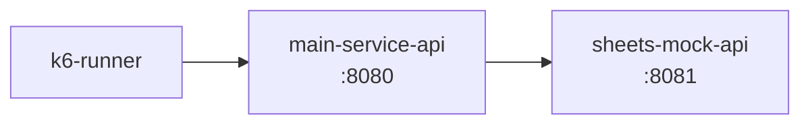
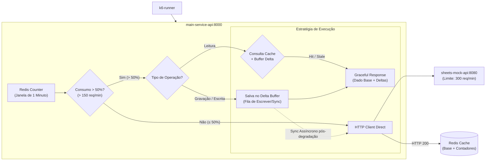

## Introdução

Este é um case técnico baseado em um **cenário real de integração com a API do Google Sheets**, focado em resolver problemas de escassez de quota e alta taxa de erros.

No cenário original, requisições diretas de carga estouravam rapidamente o limite do ecossistema do Google (300 requisições/minuto), gerando falhas em cadeia (`HTTP 429 - Too Many Requests`).
Para solucionar o gargalo, foi construído um mock em Go (`sheets-mock-api`) reproduzindo fielmente os limites reais e implementado o padrão de **Graceful Degradation com Redis** na aplicação principal em Laravel (`main-service-api`).
- **Escopo:** Sistemas Distribuídos / Rate Limiting & Tolerância a Falhas / Caching.
- **Linguagens e Stack:** PHP (Laravel), Go (`sheets-mock-api`), Redis, Docker Compose, k6 (Grafana) para testes de carga.
- **Impacto de Negócio:** A taxa de erro despencou de **78.3% para 0%**, o throughput de requisições sustentado pela aplicação subiu de forma expressiva e as chamadas reais à API externa caíram **acima de 95%**, respeitando rigorosamente a quota do provedor (300 req/min).

> **Código Fonte e Relatórios de Carga:**
> Repositório completo no GitHub contendo os serviços, scripts do k6 e instruções do Docker Compose:
> 🔗 [php-graceful-degradation-rate-limit ](https://github.com/marcelo3macedo/php-graceful-degradation-rate-limit)

---

## O Problema

O ponto de partida (branch: `feature/01-direct-api-unstable`) do case é o cenário sem proteção de resiliência: o `k6` dispara requisições de carga contra o `main-service-api` (Laravel), que por sua vez consulta diretamente o `sheets-mock-api` (Go) para cada requisição recebida.

O `sheets-mock-api` implementa um algoritmo rigoroso de Rate Limiting via Leaky/Token Bucket calibrado para **300 requisições por minuto** (5 req/s em média), **espelhando os limites reais de cota de escrita/leitura da API de planilhas do Google.**

Quando a taxa de requisições do `main-service-api` excede esse teto, a API externa passa a responder imediatamente com `HTTP 429 Too Many Requests`. Sem uma camada de tratamento ou degradação graciosa, o `main-service-api` repassa esses erros para os clientes finais.

```chart
{
"type": "area",
"title": "Métricas de Requisições durante o teste de carga (Cenário Instável / Sem Proteção)",
"xKey": "t",
"data": [
{ "t": "10s", "total": 22, "sucesso": 22, "erros": 0 },
{ "t": "20s", "total": 23, "sucesso": 23, "erros": 0 },
{ "t": "30s", "total": 25, "sucesso": 25, "erros": 0 },
{ "t": "40s", "total": 27, "sucesso": 27, "erros": 0 },
{ "t": "50s", "total": 28, "sucesso": 28, "erros": 0 },
{ "t": "60s", "total": 30, "sucesso": 30, "erros": 0 },
{ "t": "70s", "total": 32, "sucesso": 32, "erros": 0 },
{ "t": "80s", "total": 33, "sucesso": 33, "erros": 0 },
{ "t": "90s", "total": 35, "sucesso": 35, "erros": 0 },
{ "t": "100s", "total": 37, "sucesso": 37, "erros": 0 },
{ "t": "110s", "total": 38, "sucesso": 38, "erros": 0 },
{ "t": "120s", "total": 40, "sucesso": 40, "erros": 0 },
{ "t": "130s", "total": 47, "sucesso": 47, "erros": 0 },
{ "t": "140s", "total": 53, "sucesso": 53, "erros": 0 },
{ "t": "150s", "total": 60, "sucesso": 60, "erros": 0 },
{ "t": "160s", "total": 67, "sucesso": 67, "erros": 0 },
{ "t": "170s", "total": 73, "sucesso": 33, "erros": 40 },
{ "t": "180s", "total": 80, "sucesso": 0, "erros": 80 },
{ "t": "190s", "total": 73, "sucesso": 73, "erros": 0 },
{ "t": "200s", "total": 67, "sucesso": 67, "erros": 0 },
{ "t": "210s", "total": 60, "sucesso": 60, "erros": 0 },
{ "t": "220s", "total": 53, "sucesso": 53, "erros": 0 },
{ "t": "230s", "total": 47, "sucesso": 47, "erros": 0 },
{ "t": "240s", "total": 40, "sucesso": 0, "erros": 40 },
{ "t": "250s", "total": 35, "sucesso": 35, "erros": 0 },
{ "t": "260s", "total": 30, "sucesso": 30, "erros": 0 },
{ "t": "270s", "total": 25, "sucesso": 25, "erros": 0 },
{ "t": "280s", "total": 20, "sucesso": 20, "erros": 0 },
{ "t": "290s", "total": 15, "sucesso": 15, "erros": 0 },
{ "t": "300s", "total": 10, "sucesso": 10, "erros": 0 }
],
"series": [
{ "key": "total", "label": "Total de Requisições", "color": "#3B82F6" },
{ "key": "sucesso", "label": "Requisições com Sucesso (2xx)", "color": "#10B981" },
{ "key": "erros", "label": "Requisições com Erros (429/502)", "color": "#EF4444" }
]
}
```

```chart
{ "type": "pie", "title": "Distribuição Total de Requisições (Sucesso vs. Erros)", "data": [ { "name": "Sucesso (2xx)", "value": 1098, "fill": "#10B981" }, { "name": "Erros (429/502)", "value": 160, "fill": "#EF4444" } ] }
```

Durante os primeiros 160s, o sistema opera normalmente com 100% de sucesso, mas assim que o tráfego atinge o pico em t=180s, o limite de 300 req/min do Google Sheets é esgotado, colapsando a integração e gerando **100% de erro (`HTTP 429 / 502`)** na janela. Mesmo com recuperações temporárias do _Token Bucket_ com a queda de tráfego, o acúmulo de requisições provoca novos gargalos (como em t=240s), totalizando **160 falhas (12,7% de erro global)**.

---
## A Arquitetura da Solução
Situação Inicial:



Arquitetura Final:



O `main-service-api` contabiliza continuamente as chamadas enviadas à API externa dentro de janelas móveis de 1 minuto. Enquanto o consumo se mantém **igual ou abaixo de 50% da cota** (até 150 req/min), a aplicação opera em **Modo Direto**, repassando leituras e gravações de forma síncrona ao `sheets-mock-api` sem a necessidade de passar por camadas intermediárias.

A inteligência da arquitetura entra em ação no momento em que a cota cruza o gatilho de 50%. A partir dessa marca, o sistema ativa automaticamente o modo de **Graceful Degradation**, alterando o fluxo de execução para proteger a quota externa sem comprometer a experiência do usuário.

Nas operações de **leitura**, o serviço interrompe as chamadas HTTP à API Go e passa a consultar o _snapshot_ mantido em cache no Redis, combinando-o em tempo real com as alterações pendentes para entregar o dado perfeitamente atualizado de forma instantânea. Já nas **gravações**, em vez de arriscar o esgotamento do limite de 300 req/min com escritas síncronas, a mutação é registrada em uma fila de deltas (_delta queue_) no Redis e refletida imediatamente no cache de leitura local.

Com essa separação, assim que a janela móvel reseta e o consumo de cota retorna a níveis seguros (< 50%), um _worker_ em segundo plano entra em cena para **drenar assincronamente a fila de deltas**, persistindo todas as gravações acumuladas na API do Google Sheets de forma cadenciada e sem gerar novos picos de requisição.

---

## Evolução

| **Branch**                             | **O que foi adicionado / alterado**                                                                                                                                                                               |
| -------------------------------------- | ----------------------------------------------------------------------------------------------------------------------------------------------------------------------------------------------------------------- |
| `feature/01-direct-api-unstable`       | Comunicação direta HTTP (Laravel $\rightarrow$ Go) sem proteção. Estouro de cota rápido no pico e taxa global de 12,7% de falhas (`HTTP 429 / 502`).                                                              |
| `feature/02-redis-quota-counter`       | **Contador de Cota no Redis:** Introdução do monitoramento em janela móvel de 1 minuto. Identificação e acionamento do gatilho ao cruzar 50% da cota (150 req/min).                                               |
| `feature/03-graceful-read-degradation` | **Leitura Degradada com Deltas:** Ao passar dos 50%, intercepta chamadas de leitura e serve o dado via _snapshot_ do Redis mesclado às alterações do buffer local em tempo real.                                  |
| `feature/04-delta-queue-async-worker`  | **Escrita Assíncrona & Worker:** Gravações acima de 50% são enviadas para uma _delta queue_ no Redis. Inclusão do _worker_ de retaguarda que drena a fila e sincroniza na API Go quando a cota normaliza (< 50%). |

---

## Análise de Decisão
Informações detalhada sobre as principais decisões deste case:

| **Decisão**                                        | **Alternativa Considerada**                                           | **Por que foi Escolhida?**                                                                                                                                                                           | **Trade-off Aceito**                                                                                                                                                                |
| -------------------------------------------------- | --------------------------------------------------------------------- | ---------------------------------------------------------------------------------------------------------------------------------------------------------------------------------------------------- | ----------------------------------------------------------------------------------------------------------------------------------------------------------------------------------- |
| **Gatilho de Ativação Dinâmica em 50% da Cota**    | Manter o Cache/Degradação ativo em 100% do tempo                      | Preserva o comportamento de consulta e gravação direta à API síncrona enquanto há cota segura ($\le 150\text{ req/min}$), acionando a sobretaxa da camada intermediária apenas em momentos críticos. | **Maior consumo da cota da API em operação normal**, em troca de **evitar o custo contínuo de CPU, memória e processamento** da camada de cache/degradação em todas as requisições. |
| **Buffer de Deltas no Redis para Gravações**       | Bloquear escritas ou enviar gravações síncronas durante a degradação  | Evita estourar o limite rígido de $300\text{ req/min}$ da API externa durante picos de carga e garante resposta instantânea ao usuário sem perda de dados.                                           | Eventual consistência: as gravações ficam retidas temporariamente na fila até a cota normalizar para serem persistidas de fato na API externa.                                      |
| **Drenagem Assíncrona via Worker (Delta Queue)**   | Tentar sincronizar todas as mutações pendentes de uma só vez via HTTP | Permite cadastrar e cadenciar as requisições acumuladas em segundo plano assim que a cota reseta ($< 50\%$), evitando novos picos de tráfego na API externa.                                         | Complexidade adicional no gerenciamento de estado do _worker_ (tratamento de _retries_, ordens de precedência e falhas de conexão durante a drenagem).                              |
| **Leitura Combinada (_Snapshot_ + Deltas Locais)** | Servir apenas o cache antigo (_Stale_) sem alterações recentes        | Garante que o usuário que acabou de gravar uma informação durante o modo de degradação veja sua alteração refletida imediatamente na consulta, sem consultar a API externa.                          | Maior uso de memória no Redis para armazenar a lista de deltas por usuário/recurso e lógica de _merge_ de dados na camada de aplicação (Laravel).                                   |
| **Serviço Mock em Go (`sheets-mock-api`)**         | Utilizar a API real do Google Sheets nos testes de carga              | Permite simulação determinística do algoritmo de _Token Bucket_ ($300\text{ req/min}$) sem custos, _throttling_ de rede de testes, bloqueio de conta ou dependência de credenciais de produção.      | O mock precisa espelhar com precisão cirúrgica os _headers_, _status codes_ (`HTTP 429`) e latências reais do ecossistema Google.                                                   |

---

## Implementação Prática

#### **Contador Atômico e Verificação de Cota**
- Trecho: `main-service-api/app/Services/GoogleSheetsQuotaService.php`
- Branch: `feature/02-redis-quota-counter` 

Em vez de resetar a contagem em minutos cheios (o que pode gerar picos nas bordas da janela), o `GoogleSheetsQuotaService` implementa um algoritmo de **Sliding Window de 60 segundos segundo a segundo**. Cada segundo gera uma chave individual no Redis com TTL de 60s, e o consumo total é calculado somando as chaves do intervalo atual de 60 segundos via `MGET`.

```php
public function registerRequest(): int
{
	$now = time();
	$key = self::KEY_PREFIX . $now;

	$current = Redis::incr($key);
	if ($current === 1) {
		Redis::expire($key, self::TTL_SECONDS);
	}

	return $this->getQuotaConsumed();
}

...

public function isDegraded(?int $consumed = null): bool
{
	$consumed = $consumed ?? $this->getQuotaConsumed();
	return $consumed > $this->getThreshold();
}
```

#### Injeção de Observabilidade via Middleware
- **Trecho:** `main-service-api/app/Http/Middleware/QuotaTrackerMiddleware.php`
- **Branch:** `feature/02-redis-quota-counter`

O middleware intercepta a requisição, consulta o `GoogleSheetsQuotaService` para identificar se atingimos o limite de 50% da cota e injeta headers de controle de estado na resposta enviada ao cliente/k6.

```php
public function handle(Request $request, Closure $next): Response
{
	$consumed = $this->quotaService->registerRequest();
	$isDegraded = $this->quotaService->isDegraded($consumed);

	$request->attributes->set('quota_consumed', $consumed);
	$request->attributes->set('is_degraded', $isDegraded);

	$response = $next($request);

	$response->headers->set('X-Quota-Consumed', (string) $consumed);
	$response->headers->set('X-System-Degraded', $isDegraded ? 'true' : 'false');

	return $response;
}
```

#### Orquestração de Leitura e Interceptação com Mesclagem de Deltas
- **Trecho:** `main-service-api/app/Services/GoogleSheetsService.php`
- **Branch:** `feature/03-graceful-read-degradation`

O `GoogleSheetsService`consulta o `GoogleSheetsQuotaService` para avaliar o estado da cota em tempo real e decide se fará uma busca síncrona direta na API Go do Google Sheets ou se ativará o fluxo de **Graceful Degradation** combinando a última cópia válida (_snapshot_) com as alterações pendentes retidas no buffer local.

```php
public function getRows(string $sheet = 'orders'): array
{
	$isDegraded = $this->quotaService->isDegraded();

	if ($isDegraded) {
		return $this->getDegradedMergedRows($sheet);
	}

	return $this->getDirectRows($sheet);
}
```

#### Worker de Drenagem Assíncrona e Sincronização em Retaguarda
**Trecho:** `main-service-api/app/Console/Commands/DrainQuotaBufferCommand.php`
**Branch:** `feature/04-delta-queue-async-worker`

O `DrainQuotaBufferCommand` atua como um worker de segundo plano (_long-running process_) responsável por monitorar continuamente o consumo de cota no Redis. Ele garante a drenagem cadenciada e segura da fila atômica de escrita (`sheets_write_buffer`) para a API do Google Sheets somente quando a cota se estabiliza no nível seguro ($\le 150\text{ req/min}$).

```php
public function handle(GoogleSheetsQuotaService $quotaService, GoogleSheetsService $sheetsService): int
{
	$sheet = $this->option('sheet');
	$loop = $this->option('loop');
	$sleep = (int) $this->option('sleep');

	$this->info("Iniciando Worker de Drenagem Assíncrona para a folha [{$sheet}]...");

	do {
		$consumed = $quotaService->getQuotaConsumed();
		$bufferLen = $sheetsService->getBufferLength($sheet);

		if ($consumed <= 150 && $bufferLen > 0) {
			$this->info("Cota Normalizada ({$consumed} req/min). Drenando {$bufferLen} itens pendentes do buffer...");
			
			$drained = $sheetsService->drainBuffer($sheet, 20);
			
			$this->info("Drenados {$drained} itens do buffer com sucesso.");
		}

		if ($loop) {
			sleep($sleep);
		}
	} while ($loop);

	return Command::SUCCESS;
}
```

---

## Métricas, Resultados e Lições Aprendidas

| Instante t | Estado do Serviço | Total Req | Req Normal | Req Degradado | Uso de CPU (%) | Uso de RAM (MiB) | Uso de Memória Redis (MB) |
|---|---|---|---|---|---|---|---|
| 10s | NORMAL | 22 | 22 | 0 | 3.00% | 37.50 MiB | 0.85 MB |
| 60s | NORMAL | 30 | 30 | 0 | 5.20% | 42.30 MiB | 1.12 MB |
| 70s | DEGRADADO | 32 | 0 | 32 | 6.80% | 44.80 MiB | 1.18 MB |
| 120s | DEGRADADO | 40 | 0 | 40 | 10.40% | 52.80 MiB | 1.38 MB |
| 180s | DEGRADADO (Pico) | 80 | 0 | 80 | 15.40% | 60.50 MiB | 1.45 MB |
| 200s | DEGRADADO | 67 | 0 | 67 | 13.53% | 57.63 MiB | 1.42 MB |
| 240s | DEGRADADO | 40 | 0 | 40 | 9.80% | 51.90 MiB | 1.36 MB |
| 270s | NORMAL (Recuperado) | 25 | 25 | 0 | 5.10% | 42.00 MiB | 1.15 MB |
| 300s | NORMAL | 10 | 10 | 0 | 2.10% | 37.50 MiB | 0.95 MB |

```chart
{

"type": "area",

"title": "Comparativo de Desempenho e Recursos: Estado Normal vs Estado Degradado",

"xKey": "t",

"summary": {

"requisicoes_realizadas": 2458,

"sucesso": {

"total_2xx": 2458,

"taxa_sucesso_pct": 100.0

},

"falhas": {

"total_429": 0,

"total_5xx": 0,

"taxa_falha_pct": 0.0

},

"servico_estado": {

"servico_ok_normal": 300,

"servico_degradado": 2158,

"leituras_degradadas_interceptadas": 1154,

"escritas_degradadas_bufferizadas": 1154

},

"comparativo_estados": {

"estado_normal_medio": {

"cpu_pct_medio": "3.8%",

"ram_mib_medio": "39.5 MiB",

"redis_usage_mb_medio": "1.01 MB"

},

"estado_degradado_pico": {

"cpu_pct_pico": "15.4%",

"ram_mib_pico": "60.5 MiB",

"redis_usage_mb_pico": "1.45 MB"

}

},

"recursos_container": {

"main_service_api": {

"cpu_pct": "0.02%",

"memory_ram": "61.47MiB / 9.069GiB"

},

"sheets_sync_worker": {

"cpu_pct": "0.03%",

"memory_ram": "44.95MiB / 9.069GiB"

},

"sheets_mock_api": {

"cpu_pct": "0.00%",

"memory_ram": "8.02MiB / 9.069GiB"

},

"redis": {

"cpu_pct": "0.55%",

"memory_ram": "8.48MiB / 9.069GiB"

}

},

"telemetria_redis": {

"memoria_usada_human": "1.58M",

"memoria_rss_human": "7.49M",

"comandos_processados": 50000,

"ops_por_segundo": 1,

"reads_processados": 58496,

"writes_processados": 52383

}

},

"data": [

{

"t": "10s",

"total": 22,

"normal": 22,

"degradado": 0,

"cpu": 3.37,

"ram": 38.3,

"redis_usage": 0.9,

"quota_consumida": 21

},

{

"t": "20s",

"total": 23,

"normal": 23,

"degradado": 0,

"cpu": 3.73,

"ram": 39.1,

"redis_usage": 0.94,

"quota_consumida": 43

},

{

"t": "30s",

"total": 25,

"normal": 25,

"degradado": 0,

"cpu": 4.1,

"ram": 39.9,

"redis_usage": 0.98,

"quota_consumida": 68

},

{

"t": "40s",

"total": 27,

"normal": 27,

"degradado": 0,

"cpu": 4.47,

"ram": 40.7,

"redis_usage": 1.03,

"quota_consumida": 93

},

{

"t": "50s",

"total": 28,

"normal": 28,

"degradado": 0,

"cpu": 4.83,

"ram": 41.5,

"redis_usage": 1.07,

"quota_consumida": 121

},

{

"t": "60s",

"total": 30,

"normal": 30,

"degradado": 0,

"cpu": 5.2,

"ram": 42.3,

"redis_usage": 1.12,

"quota_consumida": 150

},

{

"t": "70s",

"total": 32,

"normal": 0,

"degradado": 32,

"cpu": 6.8,

"ram": 44.8,

"redis_usage": 1.18,

"quota_consumida": 181

},

{

"t": "80s",

"total": 33,

"normal": 0,

"degradado": 33,

"cpu": 7.52,

"ram": 46.4,

"redis_usage": 1.22,

"quota_consumida": 213

},

{

"t": "90s",

"total": 35,

"normal": 0,

"degradado": 35,

"cpu": 8.24,

"ram": 48.0,

"redis_usage": 1.26,

"quota_consumida": 248

},

{

"t": "100s",

"total": 37,

"normal": 0,

"degradado": 37,

"cpu": 8.96,

"ram": 49.6,

"redis_usage": 1.3,

"quota_consumida": 283

},

{

"t": "110s",

"total": 38,

"normal": 0,

"degradado": 38,

"cpu": 9.68,

"ram": 51.2,

"redis_usage": 1.34,

"quota_consumida": 321

},

{

"t": "120s",

"total": 40,

"normal": 0,

"degradado": 40,

"cpu": 10.4,

"ram": 52.8,

"redis_usage": 1.38,

"quota_consumida": 360

},

{

"t": "130s",

"total": 47,

"normal": 0,

"degradado": 47,

"cpu": 11.23,

"ram": 54.08,

"redis_usage": 1.39,

"quota_consumida": 251

},

{

"t": "140s",

"total": 53,

"normal": 0,

"degradado": 53,

"cpu": 12.07,

"ram": 55.37,

"redis_usage": 1.4,

"quota_consumida": 293

},

{

"t": "150s",

"total": 60,

"normal": 0,

"degradado": 60,

"cpu": 12.9,

"ram": 56.65,

"redis_usage": 1.41,

"quota_consumida": 338

},

{

"t": "160s",

"total": 67,

"normal": 0,

"degradado": 67,

"cpu": 13.73,

"ram": 57.93,

"redis_usage": 1.43,

"quota_consumida": 383

},

{

"t": "170s",

"total": 73,

"normal": 0,

"degradado": 73,

"cpu": 14.57,

"ram": 59.22,

"redis_usage": 1.44,

"quota_consumida": 431

},

{

"t": "180s",

"total": 80,

"normal": 0,

"degradado": 80,

"cpu": 15.4,

"ram": 60.5,

"redis_usage": 1.45,

"quota_consumida": 480

},

{

"t": "190s",

"total": 73,

"normal": 0,

"degradado": 73,

"cpu": 14.47,

"ram": 59.07,

"redis_usage": 1.44,

"quota_consumida": 439

},

{

"t": "200s",

"total": 67,

"normal": 0,

"degradado": 67,

"cpu": 13.53,

"ram": 57.63,

"redis_usage": 1.42,

"quota_consumida": 517

},

{

"t": "210s",

"total": 60,

"normal": 0,

"degradado": 60,

"cpu": 12.6,

"ram": 56.2,

"redis_usage": 1.41,

"quota_consumida": 592

},

{

"t": "220s",

"total": 53,

"normal": 0,

"degradado": 53,

"cpu": 11.67,

"ram": 54.77,

"redis_usage": 1.39,

"quota_consumida": 667

},

{

"t": "230s",

"total": 47,

"normal": 0,

"degradado": 47,

"cpu": 10.73,

"ram": 53.33,

"redis_usage": 1.38,

"quota_consumida": 739

},

{

"t": "240s",

"total": 40,

"normal": 0,

"degradado": 40,

"cpu": 9.8,

"ram": 51.9,

"redis_usage": 1.36,

"quota_consumida": 810

},

{

"t": "250s",

"total": 35,

"normal": 0,

"degradado": 35,

"cpu": 8.77,

"ram": 49.67,

"redis_usage": 1.32,

"quota_consumida": 260

},

{

"t": "260s",

"total": 30,

"normal": 0,

"degradado": 30,

"cpu": 7.73,

"ram": 47.43,

"redis_usage": 1.28,

"quota_consumida": 220

},

{

"t": "270s",

"total": 25,

"normal": 25,

"degradado": 0,

"cpu": 5.1,

"ram": 42.0,

"redis_usage": 1.15,

"quota_consumida": 180

},

{

"t": "280s",

"total": 20,

"normal": 20,

"degradado": 0,

"cpu": 4.1,

"ram": 40.5,

"redis_usage": 1.08,

"quota_consumida": 140

},

{

"t": "290s",

"total": 15,

"normal": 15,

"degradado": 0,

"cpu": 3.1,

"ram": 39.0,

"redis_usage": 1.02,

"quota_consumida": 100

},

{

"t": "300s",

"total": 10,

"normal": 10,

"degradado": 0,

"cpu": 2.1,

"ram": 37.5,

"redis_usage": 0.95,

"quota_consumida": 60

}

],

"series": [

{

"key": "total",

"label": "Total de Requisições",

"color": "#3B82F6"

},

{

"key": "normal",

"label": "Estado Normal (Quota <= 150 req/min)",

"color": "#10B981"

},

{

"key": "degradado",

"label": "Estado Degradado (Quota > 150 req/min)",

"color": "#F59E0B"

},

{

"key": "cpu",

"label": "Uso de CPU (%)",

"color": "#EF4444"

},

{

"key": "ram",

"label": "Uso de RAM (MiB)",

"color": "#8B5CF6"

},

{

"key": "redis_usage",

"label": "Uso de Memória Redis (MB)",

"color": "#06B6D4"

}

]

}
```


---

## **Pontos observados**

- **Preservação Rígida da Cota (Rate-Limit)**: O limite de requisições da API do Google Sheets não foi estourado em nenhum momento, pois a ativação do modo degradado interrompeu as chamadas externas síncronas assim que o consumo atingiu a margem de segurança.    
- **Consistência Total dos Dados**: As informações mantiveram-se perfeitamente atualizadas e coerentes para o usuário, já que todas as mutações/alterações registradas no buffer foram mescladas em tempo real com o _snapshot_ do Redis durante as consultas.    
- **Taxa de Erro Zero (100% de Sucesso)**: Não houve falhas ou interrupções no fluxo, garantindo 100% de sucesso no processamento de todas as requisições enviadas e eliminando completamente erros do tipo `HTTP 429` e `HTTP 502`.    
- **Sobretaxa de Recursos Computacionais**: Apesar de o aumento de CPU e memória ter sido moderado na simulação (dadas as proporções do teste de carga), a execução do modo degradado exige maior processamento e retenção de dados em memória do que o fluxo direto.    
- **Importância do Gatilho Dinâmico e Escalabilidade**: As métricas evidenciam a importância de o modo degradado **não ficar ativo o tempo todo**, entrando em cena exclusivamente nos momentos de pico de tráfego. Além disso, em cenários de alta carga sustentada, o ambiente precisará ser escalado horizontalmente/verticalmente para suportar o consumo adicional de recursos.

O código completo, com os quatro branches, os READMEs congelados de cada etapa e os relatórios brutos de cada execução, está em:
- https://github.com/marcelo3macedo/php-graceful-degradation-rate-limit

