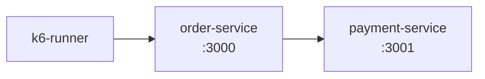
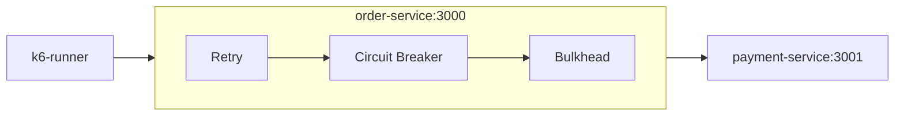

## Introdução

Este é um case de resiliência: o payment-service simula um memory leak real que cresce até o limite de memória do container, entra em crash-loop (OOM-kill + restart automático) sob carga contínua, e o order-service foi evoluindo, branch a branch, para lidar com isso: retry com backoff exponencial e jitter, circuit breaker e bulkhead.
- **Escopo:** Sistemas Distribuídos / Tolerância a Falhas Parciais.
- **Linguagens e Stack:** Node.js (Express), Docker Compose, [k6](https://k6.io/) (Grafana) para teste de carga.
- **Impacto de Negócio:** A latência $p(95)$ despencou **14x (de 3005ms para 204ms)** e o throughput de requisições aumentou em **53%**. O sistema passou a adotar uma estratégia _Fail-Fast_, priorizando a proteção de recursos do _Event Loop_ em relação à retenção de chamadas zumbis.

> **Código Fonte e Relatórios de Carga:**
> Repositório completo no GitHub contendo as 4 branches evolutivas, os scripts do k6 e instruções do Docker Compose:  
> 🔗 [github.com/marcelo3macedo/node-microservices-resilience-patterns](https://github.com/marcelo3macedo/node-microservices-resilience-patterns)

---

## O Problema

O ponto de partida do case é a branch `feature/01-base-service-unstable`: o k6 dispara requisições de carga contra o `order-service`, que por sua vez consulta o `payment-service` para confirmar cada pedido.
Só que o `payment-service` é um serviço instável, com um **memory leak real** embutido de propósito. Cada requisição que ele recebe aloca e retém um buffer, o RSS (memória física) do processo cresce continuamente sob carga até encostar no limite de memória do container (256MB), o Docker mata o processo por OOM (exit code 137).


```chart
{
  "type": "area",
  "title": "RAM do payment-service durante o teste (2 ciclos de leak → OOM-kill → restart)",
  "xKey": "t",
  "data": [
    { "t": "2s", "ram": 62.1 }, { "t": "3s", "ram": 62.1 }, { "t": "4s", "ram": 62.14 },
    { "t": "5s", "ram": 59.63 }, { "t": "6s", "ram": 85.81 }, { "t": "7s", "ram": 60 },
    { "t": "8s", "ram": 62.49 }, { "t": "9s", "ram": 66.73 }, { "t": "10s", "ram": 71.25 },
    { "t": "11s", "ram": 79.02 }, { "t": "12s", "ram": 122.2 }, { "t": "13s", "ram": 97.93 },
    { "t": "14s", "ram": 109.7 }, { "t": "15s", "ram": 122 }, { "t": "16s", "ram": 138.4 },
    { "t": "17s", "ram": 152.4 }, { "t": "18s", "ram": 195.2 }, { "t": "19s", "ram": 190.8 },
    { "t": "20s", "ram": 212.3 }, { "t": "21s", "ram": 237 }, { "t": "22s", "ram": 216 },
    { "t": "23s", "ram": 245 }, { "t": "24s", "ram": 250.1 }, { "t": "25s", "ram": 250.9 },
    { "t": "26s", "ram": 250.7 }, { "t": "27s", "ram": 239.9 }, { "t": "28s", "ram": 250.8 },
    { "t": "29s", "ram": 248.4 }, { "t": "30s", "ram": 248.3 }, { "t": "32s", "ram": 27.27 },
    { "t": "33s", "ram": 27 }, { "t": "34s", "ram": 53.9 }, { "t": "35s", "ram": 106.6 },
    { "t": "36s", "ram": 164 }, { "t": "37s", "ram": 221.8 }, { "t": "38s", "ram": 217.1 },
    { "t": "39s", "ram": 251.3 }, { "t": "40s", "ram": 251.2 }, { "t": "41s", "ram": 251.2 },
    { "t": "42s", "ram": 251.3 }
  ],
  "series": [
    { "key": "ram", "label": "RAM (MiB) — limite 256MB", "color": "#EF4444" }
  ]
}
```

A RAM sobe quase linearmente até ~250MB, despenca em torno de t+31s (OOM-kill + restart), e sobe de novo até o fim do teste.

O `order-service` apenas repassa a chamada ao `payment-service` com um timeout de 3s, sem nenhuma proteção.
O resultado sob carga: **286 requisições, 16,43% de erro, p(95) de 3004,54ms** , o timeout sendo atingido em quase 1 a cada 6 pedidos, concentrados exatamente na janela em que o `payment-service` está com a memória no limite.

---
## A Arquitetura da Solução
Situação Inicial:



Arquitetura Final:



O `order-service` é o gateway que chama o `payment-service` de forma síncrona via HTTP. Ao longo de quatro branches, ele foi ganhando camadas de proteção:

| Branch                                                                                                                                                         | O que foi adicionado                                                                 |
| -------------------------------------------------------------------------------------------------------------------------------------------------------------- | ------------------------------------------------------------------------------------ |
| [`feature/01-base-service-unstable`](https://github.com/marcelo3macedo/node-microservices-resilience-patterns/tree/feature/01-base-service-unstable)           | Cenário base: `payment-service` com memory leak real, sem nenhuma proteção           |
| [`feature/02-pattern-retry-backoff`](https://github.com/marcelo3macedo/node-microservices-resilience-patterns/tree/feature/02-pattern-retry-backoff)           | Retry com backoff exponencial + jitter, e `restart: on-failure` no `payment-service` |
| [`feature/03-pattern-circuit-breaker`](https://github.com/marcelo3macedo/node-microservices-resilience-patterns/tree/feature/03-pattern-circuit-breaker)       | Circuit breaker: falha rápido quando o `payment-service` está degradado              |
| [`feature/04-pattern-bulkhead-isolation`](https://github.com/marcelo3macedo/node-microservices-resilience-patterns/tree/feature/04-pattern-bulkhead-isolation) | Bulkhead: limite de concorrência simultânea, isolando o event loop                   |

---

## Análise de Decisão

Informações detalhada sobre as principais decisões deste case:

| **Decisão**                                                              | **Alternativa Considerada**                             | **Por que foi Escolhida?**                                                                                                  | **Trade-off Aceito**                                                                                                           |
| ------------------------------------------------------------------------ | ------------------------------------------------------- | --------------------------------------------------------------------------------------------------------------------------- | ------------------------------------------------------------------------------------------------------------------------------ |
| **Comunicação Síncrona HTTP** _(com Retry + Circuit Breaker + Bulkhead)_ | Mensageria Assíncrona _(SQS/RabbitMQ + Outbox Pattern)_ | Isolar e mensurar os padrões de resiliência em fluxos síncronos, sem a camada de consistência eventual de filas.            | Ausência de garantia de entrega de 100%. Indisponibilidade gera falha rápida (_fail-fast_) em vez de reprocessamento diferido. |
| **Janela do Circuit Breaker em 1500ms** _(Reduzida dos 3000ms padrão)_   | Manter a janela padrão de 3000ms                        | O container do `payment-service` se recupera em ~1-2s após o restart. A janela menor transita para _Half-Open_ mais rápido. | Leve risco de disparar uma requisição de teste (_Half-Open_) enquanto o serviço de destino ainda finaliza a inicialização.     |
| **Retry limitado a 3 tentativas** _(Teto de 1000ms no Backoff)_          | Mais tentativas / Teto de backoff maior                 | Evitar retenção prolongada do cliente no Event Loop durante cenários de _Crash-Loop_ no serviço.                            | Requisições que se recuperariam em uma 4ª tentativa falham antecipadamente.                                                    |

**Ao aplicar Circuit breaker, por que a taxa de erro subiu de 2,58% para 7,84%?**

Ao analisar os dados da Seção Métricas e Resultados, nota-se que a taxa de erro absoluta aumentou dos branches iniciais (2,58% no `retry+backoff`) para os mais avançados (7,84% no `circuit-breaker` e 7,00% no `bulkhead`).

**Isso não é uma regressão**, mas sim o comportamento esperado dos padrões **Circuit Breaker** e **Bulkhead**:
- **Fail-Fast vs. Retenção de Conexões:** Em vez de manter requisições presas aguardando o timeout de um serviço instável (o que esgotaria os recursos do `order-service`), a arquitetura opta por **rejeitar chamadas rapidamente**.    
- **O Impacto Positivo:** Embora a contagem pontual de erros suba, a **latência $p(95)$ despenca drasticamente**, liberando a CPU/Memória da aplicação para continuar servindo tráfego saudável de outros módulos.    

Em sistemas de alta disponibilidade, falhar rápido para proteger a saúde global do cluster é preferível a tentar salvar requisições individuais a qualquer custo.

---

## Implementação Prática

### **Retry com backoff exponencial e jitter**
- Trecho: `order-service/utils/retry.js`
- Branch: `feature/02-pattern-retry-backoff` 

O jitter evita que várias requisições retentem exatamente no mesmo instante contra um serviço que acabou de voltar:

```js
function backoffDelay(attempt, baseDelayMs, maxDelayMs) {
  const exponential = Math.min(maxDelayMs, baseDelayMs * 2 ** attempt);
  return Math.random() * exponential;
}

if (response.ok || !isRetryableStatus(response.status) || isLastAttempt) {
  return response;
}
const delay = backoffDelay(attempt, baseDelayMs, maxDelayMs);
await sleep(delay);
```

### **Circuit breaker**
- Trecho: `order-service/utils/circuit-breaker.js`
- Branch: `feature/03-pattern-circuit-breaker`

A máquina de estados CLOSED → OPEN → HALF_OPEN é a "mágica" do padrão: enquanto aberto, `canAttempt()` corta a chamada sem sequer tocar o `payment-service`:

```js
canAttempt() {
  if (this.state !== STATE.OPEN) return true;
  if (Date.now() - this.openedAt >= this.openDurationMs) {
    this.state = STATE.HALF_OPEN;
    return true;
  }
  return false;
}

onFailure() {
  this.failureCount += 1;
  const shouldOpen = this.state === STATE.HALF_OPEN || this.failureCount >= this.failureThreshold;
  if (shouldOpen) {
    this.state = STATE.OPEN;
    this.openedAt = Date.now();
    this.failureCount = 0;
  }
}
```

### **Bulkhead**
- Trecho: `order-service/utils/bulkhead.js`
- Branch: `feature/04-pattern-bulkhead-isolation`

Um contador simples de chamadas ativas; sem fila configurada, o excesso é rejeitado na hora em vez de esperar:

```js
async run(fn) {
  if (this.active >= this.maxConcurrent) {
    if (this.queue.length >= this.maxQueue) {
      throw new BulkheadRejectedError(
        `Bulkhead "${this.name}" cheio (${this.active}/${this.maxConcurrent} em execução, ${this.queue.length}/${this.maxQueue} na fila)`
      );
    }
    await new Promise((resolve) => this.queue.push(resolve));
  }
  this.active += 1;
  try { return await fn(); } finally { this.active -= 1; }
}
```

---

## Métricas, Resultados e Lições Aprendidas

Números de cada execução (uma por branch), estão detalhados em cada branch nos arquivos `results/report.txt` e `results/k6-summary.json`.

| Branch          | Requisições (req/s) | Erro % | p50     | p90       | p95       | Máx       |
| --------------- | ------------------- | ------ | ------- | --------- | --------- | --------- |
| Base            | 286 (8,16)          | 16,43% | 33,11ms | 3002,77ms | 3004,54ms | 3034,73ms |
| Retry           | 388 (11,03)         | 2,58%  | 16,70ms | 467,80ms  | 1148,36ms | 2432,52ms |
| Circuit Breaker | 459 (13,00)         | 7,84%  | 11,73ms | 196,96ms  | 399,79ms  | 1370,63ms |
| Bulkhead        | 443 (12,56)         | 7,00%  | 16,08ms | 105,03ms  | 204,89ms  | 2561,69ms |

```chart
{
  "type": "line",
  "title": "Latência (ms) por percentil, por branch",
  "xKey": "branch",
  "data": [
    { "branch": "01 - Base", "p50": 33.11, "p90": 3002.77, "p95": 3004.54 },
    { "branch": "02 - Retry", "p50": 16.70, "p90": 467.80, "p95": 1148.36 },
    { "branch": "03 - + Circuit Breaker", "p50": 11.73, "p90": 196.96, "p95": 399.79 },
    { "branch": "04 - + Bulkhead", "p50": 16.08, "p90": 105.03, "p95": 204.89 }
  ],
  "series": [
    { "key": "p50", "label": "p50 (mediana)", "color": "#10B981" },
    { "key": "p90", "label": "p90", "color": "#F59E0B" },
    { "key": "p95", "label": "p95", "color": "#EF4444" }
  ]
}
```

```chart
{
  "type": "bar",
  "title": "Taxa de erro HTTP (%) por branch",
  "xKey": "branch",
  "data": [
    { "branch": "01 - Base", "erro": 16.43 },
    { "branch": "02 - Retry", "erro": 2.58 },
    { "branch": "03 - + Circuit Breaker", "erro": 7.84 },
    { "branch": "04 - + Bulkhead", "erro": 7.00 }
  ],
  "series": [
    { "key": "erro", "label": "Taxa de erro (%)", "color": "#EF4444" }
  ]
}
```

```chart
{
  "type": "bar",
  "title": "Pedidos confirmados vs. falhos, por branch",
  "xKey": "branch",
  "stacked": true,
  "data": [
    { "branch": "01 - Base", "sucesso": 239, "erro": 47 },
    { "branch": "02 - Retry", "sucesso": 378, "erro": 10 },
    { "branch": "03 - + Circuit Breaker", "sucesso": 423, "erro": 36 },
    { "branch": "04 - + Bulkhead", "sucesso": 412, "erro": 31 }
  ],
  "series": [
    { "key": "sucesso", "label": "Sucesso (201)", "color": "#10B981" },
    { "key": "erro", "label": "Falha (502/503)", "color": "#EF4444" }
  ]
}
```

```chart
{
  "type": "bar",
  "title": "Throughput (requisições/s), por branch",
  "xKey": "branch",
  "data": [
    { "branch": "01 - Base", "rps": 8.16 },
    { "branch": "02 - Retry", "rps": 11.03 },
    { "branch": "03 - + Circuit Breaker", "rps": 13.00 },
    { "branch": "04 - + Bulkhead", "rps": 12.56 }
  ],
  "series": [
    { "key": "rps", "label": "req/s", "color": "#3B82F6" }
  ]
}
```

Na última branch, com os três padrões ativos ao mesmo tempo, dá para ver exatamente qual mecanismo interceptou cada tipo de degradação:

```chart
{
  "type": "bar",
  "title": "Mecanismos de resiliência disparados no branch 04 (por evento)",
  "xKey": "mecanismo",
  "data": [
    { "mecanismo": "Bulkhead: rejeição imediata (503)", "eventos": 19 },
    { "mecanismo": "Circuit breaker: fail-fast", "eventos": 5 },
    { "mecanismo": "Retry: tentativas disparadas", "eventos": 11 }
  ],
  "series": [
    { "key": "eventos", "label": "Eventos", "color": "#7C3AED" }
  ]
}
```

---

## **Pontos observados**

- **Retry + restart automático são um combo, não peças isoladas:** das 26 chamadas que falharam na primeira tentativa no branch (retry-backoff), 16 foram salvas porque a tentativa seguinte já pegou o `payment-service` reiniciado. O retry sozinho não salvaria uma indisponibilidade sustentada.
- **Latência p(95) caiu 14x (3005ms → 205ms)**, mas não de forma monotônica em cada métrica: a latência **máxima** do branch (bulkhead) (2562ms) é maior que a do branch (circuit-breaker) (1371ms), porque o bulkhead sem fila deixa passar direto quem não foi rejeitado, mesmo que o `payment-service` esteja num momento ruim do ciclo de memória.
- Por que a Latência Máxima subiu no Bulkhead (2562 ms) em comparação ao Circuit Breaker (1371 ms)?
	- A diferença entre as latências máximas ocorre devido à forma como cada padrão lida com chamadas a um serviço degradado (_payment-service_ em ciclo de gargalo de memória):
		- **Circuit Breaker (_Fail-Fast_):** Ao detectar a taxa de erros, o circuito "abre" e passa a rejeitar hamadas **imediatamente** (em poucos milissegundos), sem sequer repassá-las ao serviço de destino. Como nenhuma requisição fica esperando pelo processamento lento do serviço instável, a latência máxima registrada permanece baixa (**1371 ms**).    
		- **Bulkhead sem Fila (Concorrência Limitada):** O Bulkhead limita apenas a quantidade de chamadas simultâneas (ex.: máximo de 10).    
		    - **Excedentes (11ª em diante):** São rejeitadas instantaneamente com erro `503`.   
		    - **Permitidas (as 10 primeiras):** Conseguem passar para o serviço de pagamento. Contudo, se o serviço estiver extremamente lento (prestes a dar _Out Of Memory_), essas poucas requisições permitidas ficam retidas aguardando a resposta, o que eleva a latência máxima isolada para **2562 ms**.
- **Taxa de erro não é a métrica que deve ser otimizada isoladamente.** Os branches (circuit-breaker e bulkhead) aceitam mais erro (7,84% / 7,00%) que o branch (retry backoff) (2,58%) em troca de latência muito mais previsível e do isolamento entre serviços. A decisão certa depende do que o negócio valoriza mais: menos pedidos falhos ou um sistema que nunca trava em cascata.
- **Garantia de entrega é um problema arquitetural diferente.** Nenhum desses três padrões entrega 100% dos pedidos sob uma indisponibilidade sustentada do `payment-service`, isso exigiria uma camada assíncrona (fila/outbox), fora do escopo deste case.

O código completo, com os quatro branches, os READMEs congelados de cada etapa e os relatórios brutos de cada execução, está em:
- [github.com/marcelo3macedo/node-microservices-resilience-patterns](https://github.com/marcelo3macedo/node-microservices-resilience-patterns).
